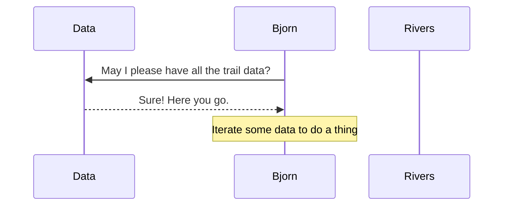

# Visualizing the Project

## Dependency Graph

First, create a <analogy>dependency graph</analogy> to visualize the decisions you made for this project - whether you chose to modularize by resource, or by functionality. Start with the Björn module, look at what it imports, and go from there.

## Sequence Diagram

Second, draw a <analogy>sequence diagram</analogy> that displays the <analogy>algorithm</analogy> for this project. Make sure you have a step in the sequence for every import, every loop _(wherever the loop happens)_.

Here is an example to get started. Yours may not look like this at all, it's just one possibility.

