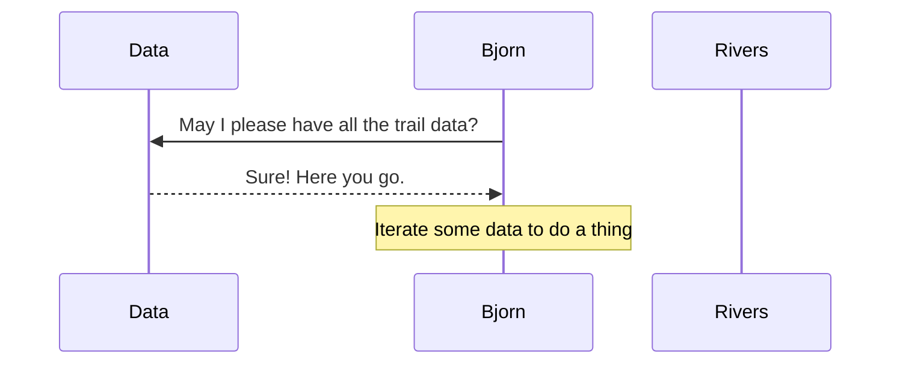

## Visualizing the Project

## Dependency Graph

First, create a <analogy>dependency graph</analogy> to visualize the decisions you made for this project - whether you chose to modularize by resource, or by functionality. Start with the Björn module, look at what it imports, and go from there.

## Sequence Diagram

Second, draw a <analogy>sequence diagram</analogy> that displays the <analogy>algorithm</analogy> for this project. Make sure you have a step in the sequence for every import, every loop _(wherever the loop happens)_.

Here is an example to get started. Yours may not look like this at all, it's just one possibility.

```mermaid
sequenceDiagram
    participant Data
    participant Bjorn
    participant Rivers
    Bjorn->>Data: May I please have all the trail data?
    Data-->>Bjorn: Sure! Here you go.
    note over Bjorn: Iterate some data to do a thing
```

    
🏛️ CS Theory Check-in: Encapsulation, Single Responsibility, Interface Segregation

You built a graph like this once before, back in Sequina's Surf Shop. This time its shape depends on a decision you made yourself in the last chapter, whether to modularize by content type or by function. Look at your dependency graph. Does it show each module doing one clear job? Are there any arrows you didn't expect, places where a module reaches into another more than it needs to?

