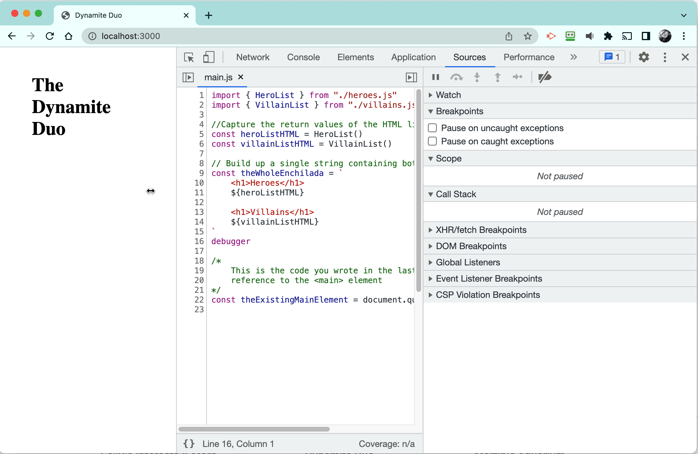

Stay in your `main.js` module and now you're going to build the new HTML that you want to be in the `<main>` HTML element.

## Dynamic HTML

Place the following code in the main module above your line of code that you added in the previous chapter.

```js
// Import the function references that generate the HTML lists
import { HeroList } from "./heroes.js"
import { VillainList } from "./villains.js"

// Capture the return values of the HTML list generators
const heroListHTML = HeroList()
const villainListHTML = VillainList()

// Build up a single string containing both chunks of HTML
const theWholeEnchilada = `
    <h1>Heroes</h1>
    ${heroListHTML}

    <h1>Villains</h1>
    ${villainListHTML}
`
debugger

/*
    This is the code you wrote in the last chapter to get a
    reference to the <main> element
*/
const theExistingMainElement = document.querySelector("#container")
```

Then refresh your browser and inspect that value of the `theWholeEnchilada` variable. You will see that it is a large HTML string made up of what the HTML generator function in the other modules produce.



<details class="cs-theory">
    <summary>🏛️ CS Theory Check-in: Single Responsibility</summary>

`HeroList` only knows how to build hero HTML, and `VillainList` only knows how to build villain HTML. Neither one knows about the other, and neither one knows how its output will eventually get used. `main.js` is the only place that combines them into `theWholeEnchilada`. What would you have to change if you only wanted to display heroes on one page and villains on another?

</details>

Now remove the `debugger` statement and move on to the next chapter to see how to place this new HTML string into the visible part of the browser.