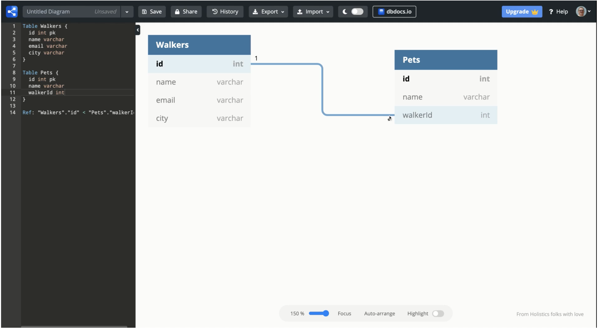

# Entity Relationship Diagrams

In this chapter, you are going to use, discuss, and learn how to create your first Entity Relationship Diagram (<analogy>ERD</analogy>). An ERD is a vital tool for software developers so that the data and the relationships between them can be visualized.

## Learning Objectives

* You should be able to explain the purpose of an ERD.
* You should be able to identify resources, fields, <analogy>primary keys</analogy>, and <analogy>foreign keys</analogy> on an ERD.
* You should be able to define resources, their fields, and their relationships in dbdiagram.
* You should be able to explain what a _1 -> many_ relationship is.

## Videos to Watch

1. <a href="https://www.youtube.com/watch?v=QpdhBUYk7Kk" target="_blank" rel="noopener noreferrer">Entity Relationship Diagram (ERD) Tutorial - Part 1</a>
1. <a href="https://www.youtube.com/watch?v=-CuY5ADwn24" target="_blank" rel="noopener noreferrer">Entity Relationship Diagram (ERD) Tutorial - Part 2</a>

## Video Walkthrough

Now that you have been introduced to the vocabulary and concepts of visualizing the resources in a database, watch this next video for defining an ERD for DeShawn's Dog Walking service.

