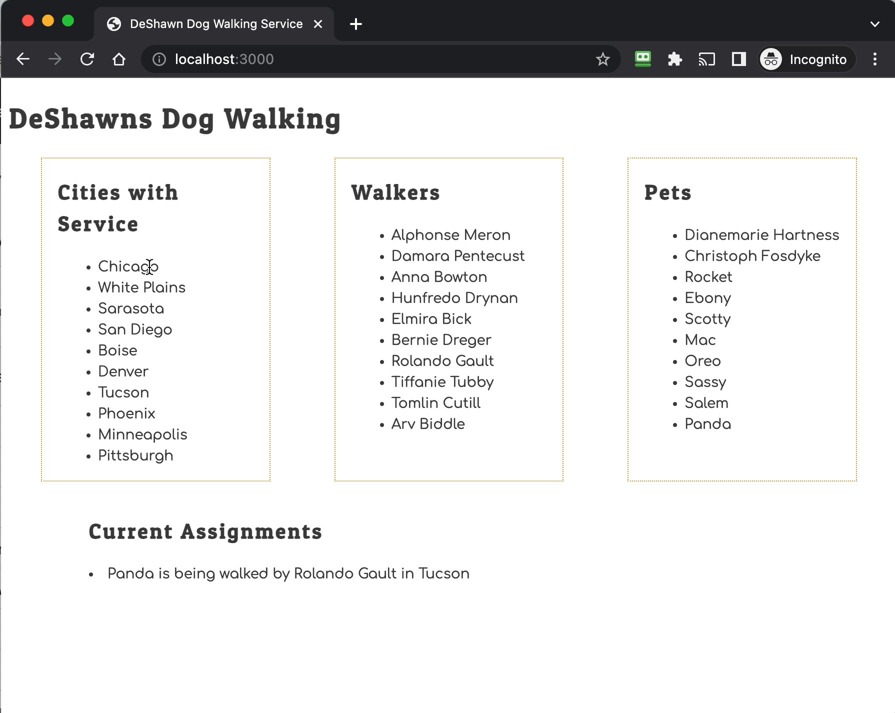

In this chapter, you continue your journey of embedding hidden state into the DOM - that your users can't see - to add some more interactivity to your project. When a city is clicked on, the walkers working in that city should be displayed.

Watch the following video another example of using data attributes stored in the DOM to make your project interactive.

    
🏛️ CS Theory Check-in: Polymorphism

This is the same shape of logic you just wrote for finding a pet's walker: read a foreign key out of hidden DOM state, iterate an array looking for the matching id, then use what you find. Only the data changed, walkers instead of cities. Where else in this project might that same "search an array for a matching id" shape show up again?

