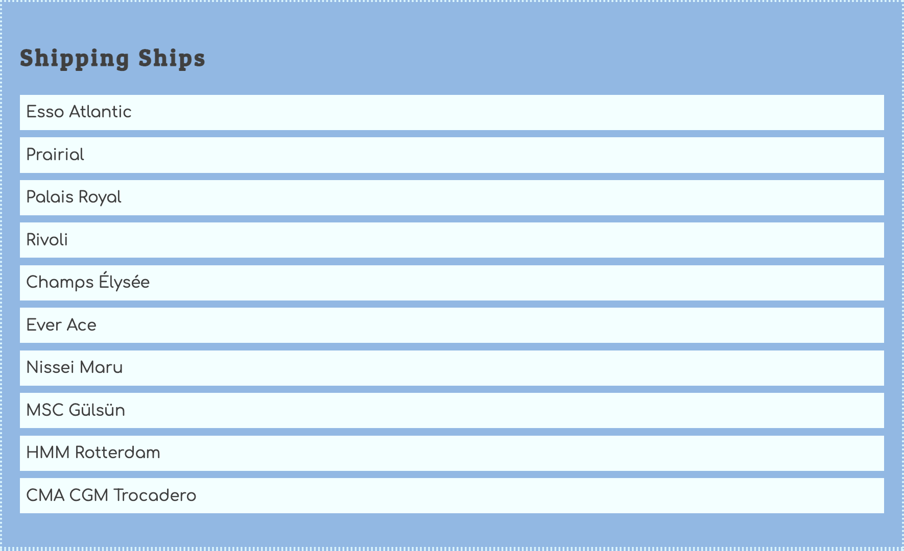

Now build out the module to create the HTML for a list of available shipping ships.



Here is some starter code for adding an array of shipping ship objects to your database. Only the primary key is provided. Refer back to your ERD and add objects to the array that contain all of the needed properties. Create several ship objects that can be hauled around the world.

```js
const database = {
    docks: [...],
    haulers: [...],
    shippingShips: []
}
```

Remember to put an accessor, or getter, function in the database module so that the other modules can get a copy of this array of objects.

```js
export const getShippingShips = () => {
    // You write the code for copying the array and returning it
}
```

<details class="cs-theory">
    <summary>🏛️ CS Theory Check-in: Encapsulation, Interface Segregation</summary>

This is the third time you've built this same shape: a database module holding the array, and an accessor function that hands out a copy of it. Why do you think an accessor function is used here instead of just exporting the `docks`, `haulers`, and `shippingShips` arrays directly?

</details>

## Build an HTML List of Shipping Ships

Now open your module that is responsible for building the HTML for each shipping ship and implement the code.
