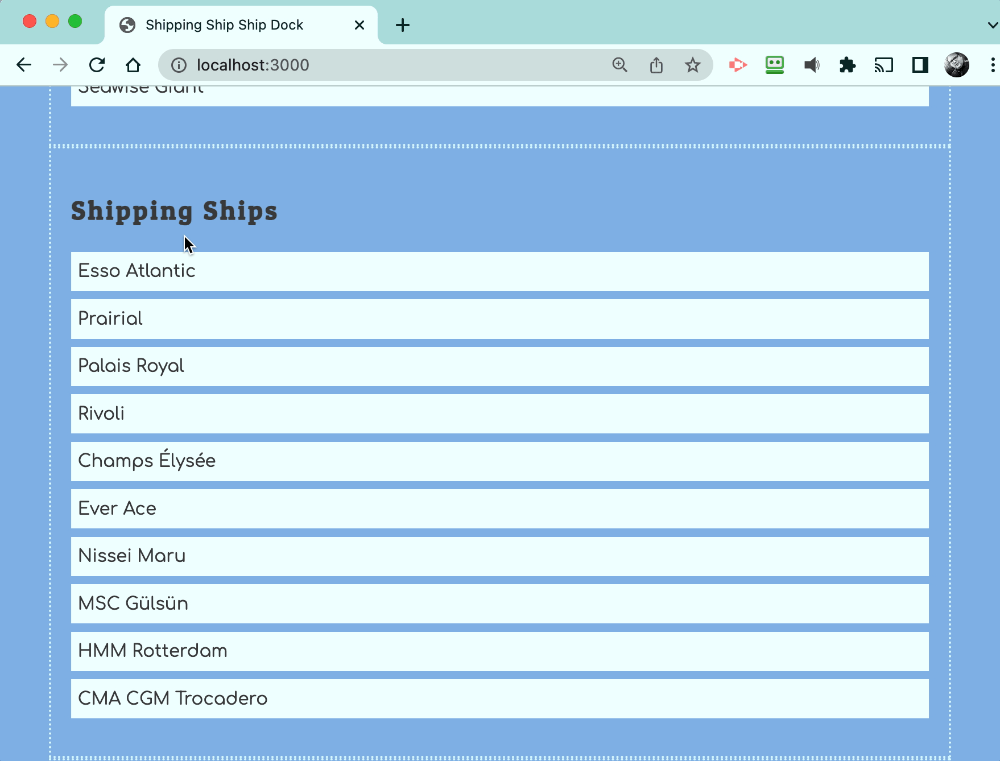

The next step for you is to add a click event listener that displays the hauler for each shipping ship.



## Handling Click Event

Add the following click event listener to the shipping ships list module and capture the DOM element that was clicked. The algorithm is included. Review it carefully.

```js
document.addEventListener(
    "click",
    (clickEvent) => {
        const itemClicked = clickEvent.target

        // Was a shipping ship list item clicked?

            // Get the haulerId value of the shipping ship clicked

            // Define a default object for the found hauler
            let haulingShip = { name: "Incorrect" }

            // Iterate the array of hauler objects

                // Does the haulerId foreign key match the id of the current hauler?

                    // Reassign the value of `haulingShip` to the current hauler

            // Show an alert to the user with this format...
            // Palais Royal is being hauled by Seawise Giant
    }
)
```

What information does this algorithm need to do its job?

* The type of item was clicked _(i.e. a shipping ship was clicked)_.
* The `haulerId` value of the shipping ship that was clicked.
* The name of the shipping ship that was clicked.
* The array of haulers so that it can be iterated.

Use data attributes on the shipping ship list items to make this data available to your JavaScript algorithm when a list item is clicked.

<details class="cs-theory">
    <summary>🏛️ CS Theory Check-in: Polymorphism</summary>

This algorithm iterates an array and compares a foreign key, just like the previous exercise did to count matching ships. But this one stops as soon as it finds a match and keeps a single object, instead of counting how many matches there are. Same basic shape, iterate and compare, different job. Where else in this course have you seen that same "iterate and compare" shape used for a different purpose each time?

</details>
