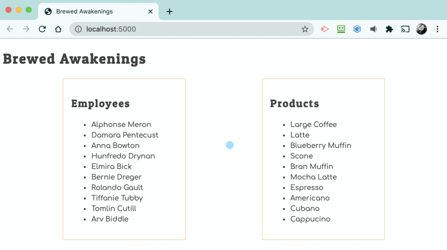

# Viewing Product Prices on Click

Using code from the last project as an example, attempt adding a <analogy>click event</analogy> listener that presents an alert box showing the price of a product when it is clicked by the user.



If you find yourself creeping up on 30 minutes of trying to get the code to work, it's time to go to a peer, or an mentor for assistance.

As always, you can peek at most of the solution:

<details>
<summary>Peek at most of the solution</summary>

```js
document.addEventListener(
    "click",
    (clickEvent) => {
        const itemClicked = clickEvent.target

        if (itemClicked.dataset.type === "product") {
            for (const product of products) {
                if (product.id === parseInt()) {
                    window.alert(`${} costs ${} `)
                }
            }
        }
    }
)
```

</details>