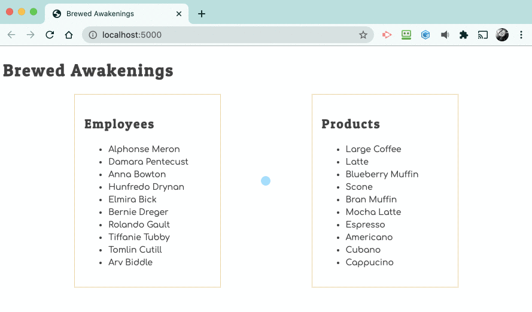

# Displaying Number of Products Sold

Using code from the last project as an example, attempt adding a click <analogy>event listener</analogy> that presents an alert box showing how many products an employee has sold when their name is clicked.

If you find yourself creeping up on 30 minutes of trying to get the code to work, it's time to go to a peer, or an mentor for assistance.

You can peek at [some of the solution](./code/employeeSales.js) if you need to.

## Dev Tools Practice

Use the <analogy>Event Listeners panel</analogy> to discover, and the <analogy>Event Listener Breakpoints</analogy> panel to debug, the events in your code. If you don't know what this means, then you skipped chapter 5 of the guided tour.

Go read that chapter now and watch the accompanying video.