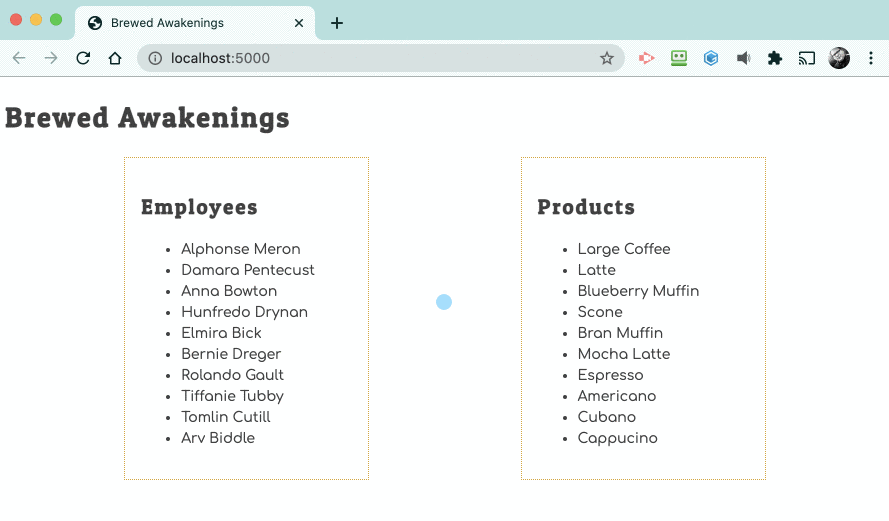

## Displaying Number of Products Sold

Using code from the last project as an example, attempt adding a click <analogy>event listener</analogy> that presents an alert box showing how many products an employee has sold when their name is clicked.



If you find yourself creeping up on 30 minutes of trying to get the code to work, it's time to go to a peer, or a mentor for assistance.

You can peek at some of the solution if you need to:

<details>
<summary>Peek at some of the solution</summary>

```js
const employeeOrders = (id) => {
    let fulfilledOrders = 0

    for (const order of orders) {
        if (order.employeeId === id) {
            // Increment the number of fulfilled orders
        }
    }

    // Return how many orders were fulfilled
}

document.addEventListener(
    "click",
    (clickEvent) => {
        const itemClicked = clickEvent.target
        if (itemClicked.dataset.type === "employee") {
            const employeeId = itemClicked.dataset.id

            for (const employee of employees) {
                if ( === parseInt(employeeId)) {

                    const orderCount = employeeOrders()

                    window.alert(` ${employee.name} sold ${} products `)
                }
            }
        }
    }
)
```

</details>

<details class="cs-theory">
    <summary>🏛️ CS Theory Check-in: Polymorphism</summary>

Same shape again: read a piece of data off the clicked element, search an array for the object whose id matches, then do something with what you find. You just wrote this for products, now you're writing it for employees. What's the part of this shape that never changes, no matter which array you're searching?

</details>

<details class="cs-theory">
    <summary>🏛️ CS Theory Check-in: Single Responsibility</summary>

Notice that counting an employee's orders got pulled out into its own `employeeOrders` function instead of being written directly inside the click handler. The click handler's job is to react to a click and show an alert, not to know how order counts are calculated. If the business later asked for order counts to show up somewhere else too, a report page, say, you'd already have a function for that, no digging through click handler code required.

</details>

## Dev Tools Practice

Use the <analogy>Event Listeners panel</analogy> to discover, and the <analogy>Event Listener Breakpoints</analogy> panel to debug, the events in your code. If you don't know what this means, then you skipped chapter 5 of the guided tour.

Go read that chapter now and watch the accompanying video.