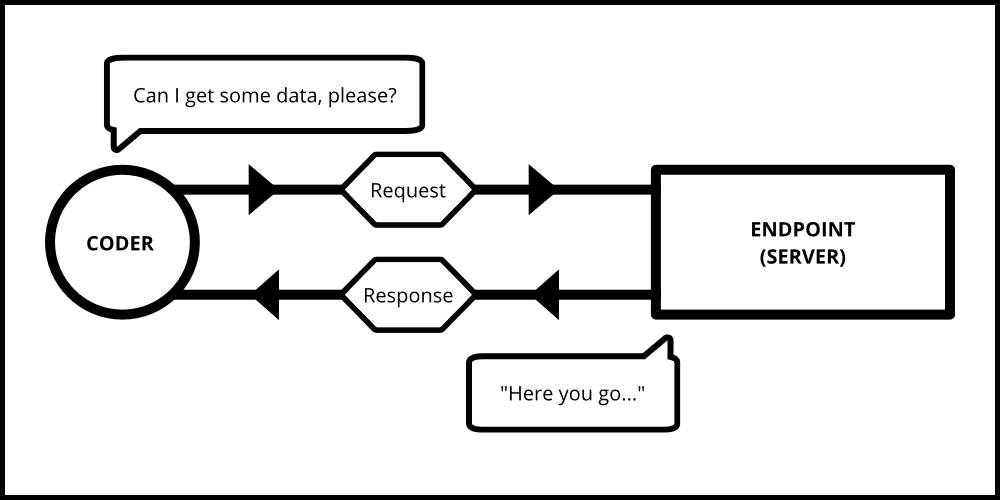
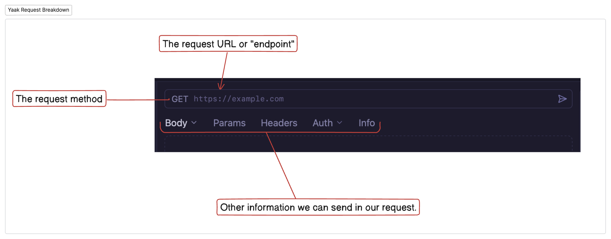
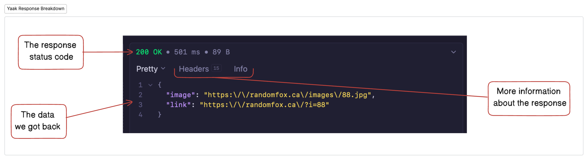
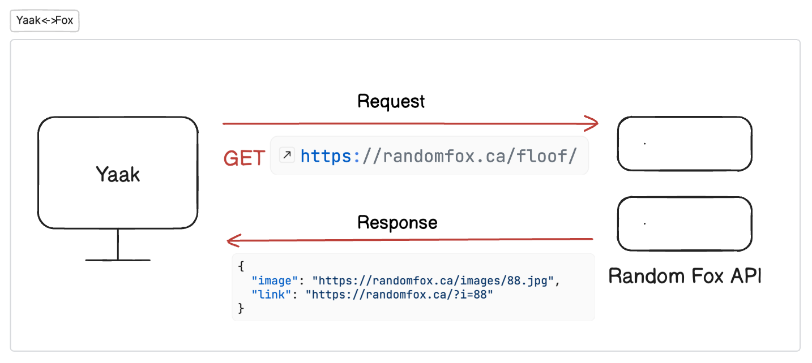

# External APIs and Testing with Yaak

## Fetching Data

Software developers have access to a bountiful world of data that companies, and other developers, make available for them to <analogy>request</analogy> and use in their own applications. Up to this point in the course, you've been using your own data contained in a file on your machine.

In this introduction, you are going to <analogy>request</analogy> data from someone else's computer somewhere else in the world via the World Wide Web (WWW). 

You will be able to access this data by making requests to an <analogy>API</analogy>.

## Introduction to APIs

An <analogy>API</analogy> (Application Programming Interface) is a set of rules and protocols that allows different software applications to communicate with each other. Think of an <analogy>API</analogy> as a waiter in a restaurant:

1. You (the <analogy>client</analogy>) make a <analogy>request</analogy> from the menu
2. The waiter (the <analogy>API</analogy>) takes your <analogy>request</analogy> to the kitchen
3. The kitchen (the <analogy>server</analogy>) prepares what you ordered
4. The waiter brings back your food (the <analogy>response</analogy>)

## Communication Between an API and a Client

When a <analogy>client</analogy> application needs to interact with an <analogy>API</analogy>, it follows a <analogy>request</analogy>-<analogy>response</analogy> cycle:

1. **<analogy>Client</analogy> Makes a <analogy>Request</analogy>**: Your application sends a <analogy>request</analogy> to a specific URL (<analogy>endpoint</analogy>) with details about what it wants
2. **<analogy>API</analogy> Processes the <analogy>Request</analogy>**: The <analogy>server</analogy> receives the <analogy>request</analogy>, processes it, and determines what to send back
3. **<analogy>Server</analogy> Prepares a <analogy>Response</analogy>**: The <analogy>server</analogy> gathers the requested data from the database or performs the requested action
4. **<analogy>API</analogy> Returns the <analogy>Response</analogy>**: The <analogy>server</analogy> sends back data (usually in <analogy>JSON</analogy> format) and a <analogy>status code</analogy>
5. **<analogy>Client</analogy> Processes the <analogy>Response</analogy>**: Your application receives the data and uses it as needed

### Common HTTP Methods in API Requests:

- **<analogy>GET</analogy>**: Retrieve data (what we'll focus on today)
- **<analogy>POST</analogy>**: <analogy>Create</analogy> new data
- **<analogy>PUT</analogy>/<analogy>PATCH</analogy>**: <analogy>Update</analogy> existing data
- **<analogy>DELETE</analogy>**: Remove data

## ⚠️ Be Prepared, Beginner!

This is one of the most significant cognitive challenges that beginner software developers face. The <analogy>asynchronous</analogy> nature of how the web browser handles WWW requests stretches your working memory to capacity. It will take weeks and weeks of practice before you have any chance of truly understanding the mechanism. You may not gain understanding until after your time at NSS and a year or two on the job. However, you will learn how to write the correct syntax for one and where you need to make the requests.

Come back to this chapter and review the section describing <analogy>API</analogy>'s given above as you complete the chapters and projects in this course. If you do so, this explanation will begin to make more sense to you.

## 🦊🐶 Introducing Fun Image APIs

For our Foxy Dog project, we'll be working with two APIs that <analogy>return</analogy> random animal images:

1. **Random Fox <analogy>API</analogy>**: Provides random fox images
   - <analogy>Endpoint</analogy>: `https://randomfox.ca/floof/`
   - Returns a <analogy>JSON</analogy> <analogy>object</analogy> with an image URL

2. **Random Dog <analogy>API</analogy>**: Provides random dog images
   - <analogy>Endpoint</analogy>: `https://random.dog/woof.json`
   - Returns a <analogy>JSON</analogy> <analogy>object</analogy> with an image URL

## Testing APIs with Yaak

Before integrating these APIs into our application, we should test them to understand how they work and what data they <analogy>return</analogy>. For this, we'll use **Yaak**, a user-friendly <analogy>API</analogy> testing tool.

### What is Yaak? 

Yaak is an <analogy>API</analogy> testing tool that allows developers to send requests to APIs and view the responses in a clean, organized interface. There are many other <analogy>api</analogy> testing tools that offer the same functionality, but Yaak is much simpler and easier for beginners so we will use it throughout the course. 

### Installing Yaak

1. Visit <a href="https://yaak.app/" target="_blank" rel="noopener noreferrer">https://yaak.app/</a>
2. Click on the download button for your operating system
3. Follow the installation instructions
4. Launch the application

### Making a GET Request with Yaak

Now that you have Yaak installed, let's make our first <analogy>GET</analogy> <analogy>request</analogy> to the Random Fox <analogy>API</analogy>:

1. Open Yaak
2. Click on the + or use the keyboard shortcut to open a new <analogy>request</analogy>
3. Choose **<analogy>HTTP</analogy>**
4. Ensure the <analogy>request</analogy> method is set to `GET`
5. In the <analogy>request</analogy> URL field, enter: `https://randomfox.ca/floof/`
6. Click the "Send" button

You should see a <analogy>response</analogy> that looks something like this:

### Understanding the Response

When you make a <analogy>GET</analogy> <analogy>request</analogy> to an <analogy>API</analogy>, there are two important elements to pay attention to for now:

#### Status Code
The <analogy>status code</analogy> tells you whether your <analogy>request</analogy> was successful:
- **200**: Success! Everything worked as expected.
- **404**: Not Found - The <analogy>endpoint</analogy> you're trying to reach doesn't exist.
- **500**: <analogy>Server</analogy> Error - Something went wrong on the <analogy>server</analogy>'s end.

For a successful <analogy>request</analogy> to our animal APIs, you should see a <analogy>status code</analogy> of **200**.

#### Response Body
This contains the actual data returned by the <analogy>API</analogy>. In our case, it's a <analogy>JSON</analogy> <analogy>object</analogy> with an image URL.

## So what happened?

The <analogy>client</analogy>, Yaak, made a <analogy>request</analogy> to the random fox <analogy>api</analogy> over the world wide web. The random fox <analogy>api</analogy>, running on some computer somewhere else in the world, processed that <analogy>request</analogy> and returned to the <analogy>client</analogy> what it asked for in a <analogy>response</analogy>, along with some more information about the <analogy>response</analogy>, such as the status of that <analogy>response</analogy>.

Let's see what that looks like. 

## 📓 Key Concepts to Remember
1. **<analogy>Client</analogy>:** The application that sends a <analogy>request</analogy> for data or services. This is like you, the customer, in a restaurant.
2. **<analogy>API</analogy>:** (Application Programming Interface): A set of rules that allows one piece of software to talk to another. Think of it as a menu in a restaurant - it lists what you can order and how to ask for it.
3. **<analogy>Server</analogy>:** The computer that receives requests from clients and sends back responses. This is like the kitchen in a restaurant that prepares your food.
4. **<analogy>Endpoint</analogy>:** A specific URL where an <analogy>API</analogy> can be accessed. Think of it as a specific counter or window where you place your order in a restaurant.
5. **<analogy>Request</analogy>:** The message a <analogy>client</analogy> sends to a <analogy>server</analogy> asking for something. This is like placing your order in a restaurant.
6. **<analogy>Response</analogy>:** The data that the <analogy>server</analogy> sends back to the <analogy>client</analogy> after receiving a <analogy>request</analogy>. This is like the food you receive after ordering.
6. **<analogy>Status Code</analogy>:** A <analogy>number</analogy> that indicates whether a <analogy>request</analogy> was successful or not. Think of it as the waiter telling you "Your food is ready" (200 OK) or "Sorry, we're out of that dish" (404 Not Found).

## 🎓 Practice Exercise: Testing the Random Dog API

Now it's your turn to test the Random Dog <analogy>API</analogy>:

Using Yaak, make a **<analogy>GET</analogy>** <analogy>request</analogy> to the [Random Dog <analogy>Api</analogy>](#-introducing-fun-image-apis).

### Questions to Answer:

1. What <analogy>status code</analogy> did you receive?
2. What does the <analogy>response</analogy> <analogy>JSON</analogy> structure look like?
3. How is it different from the Fox <analogy>API</analogy> <analogy>response</analogy>?
4. Copy the image URL from the <analogy>response</analogy> and paste it into a browser. What happens?

## 📝 What We've Learned

In this chapter, we've:
- Learned what an <analogy>API</analogy> is and how it enables communication between applications
- Explored how clients and servers interact through APIs
- Discovered two fun animal image APIs
- Used Yaak to test <analogy>API</analogy> endpoints
- Made <analogy>GET</analogy> requests and examined the responses

This foundational knowledge will prepare you for the next steps where we'll learn how to integrate these APIs into our application using JavaScript's fetch <analogy>API</analogy> and handle the responses using promises.

## 🔜 Next Steps

In the upcoming chapters, we'll:
- Write <analogy>client</analogy>-side JavaScript to fetch data from our animal APIs
- Learn about promises and how to use `.then()` syntax
- Explore the modern `async/await` syntax for handling <analogy>asynchronous</analogy> operations
- Build a fun application that displays random fox and dog images
