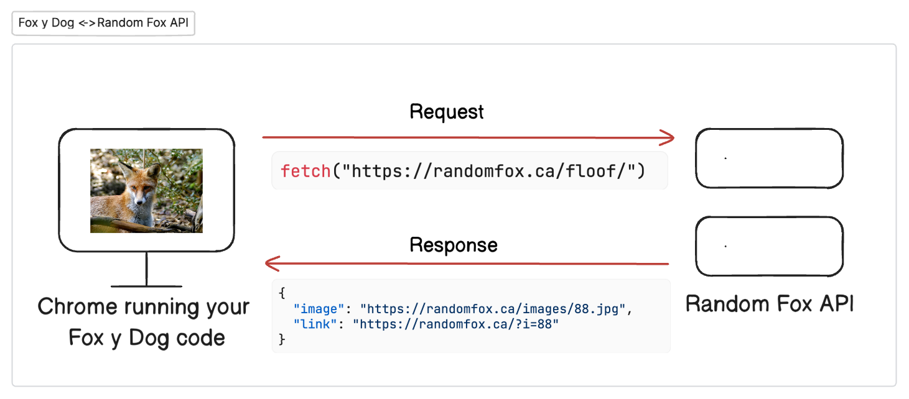
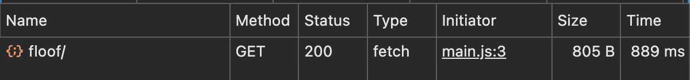
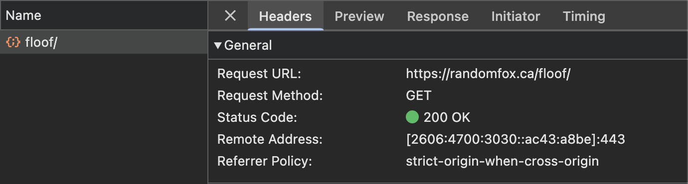
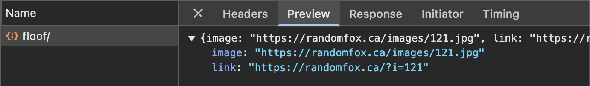

# Using Fetch and Monitoring Network Requests

## Introduction to Fetch

Now that we understand what APIs are and have tested them using Yaak, it's time to interact with these APIs directly from our JavaScript code. We'll use the built-in `fetch()` <analogy>function</analogy> to make requests to our animal APIs.

### What is Fetch?

The `fetch()` <analogy>function</analogy> is a built-in JavaScript method that allows us to make network requests to servers and APIs. It's the foundation of <analogy>client</analogy>-side <analogy>API</analogy> communication in modern web applications.

Think of fetch as your web browser's way of "reaching out" across the internet to grab data from another computer (<analogy>server</analogy>).

### How Fetch Works:

1. Your JavaScript code calls the `fetch()` <analogy>function</analogy> with a URL as a <analogy>argument</analogy>
2. The browser sends an <analogy>HTTP</analogy> <analogy>request</analogy> to that URL
3. The <analogy>server</analogy> processes the <analogy>request</analogy> and sends back a <analogy>response</analogy>
4. Your code can then use the data from the <analogy>response</analogy>



## Writing Your First Fetch Call

Let's start by writing a simple fetch call to the Random Fox <analogy>API</analogy> we explored earlier. In our application, when the user clicks the **<analogy>Get</analogy> Fox** button, we want to get a random fox image using the randomfox <analogy>api</analogy>. Take a look at `main.js`. There are two click events there, one for the fox button and one for the dog button. Add the following line of code to your `main.js` file to run when the fox button is clicked. 

```js
fetch("https://randomfox.ca/floof/")
```

>💡 The `fetch()` <analogy>function</analogy> makes a <analogy>GET</analogy> <analogy>request</analogy> by default. This means unless specified in an optional second <analogy>argument</analogy>, this <analogy>function</analogy> will use the <analogy>GET</analogy> method instead of <analogy>POST</analogy>, <analogy>PUT</analogy>, or <analogy>DELETE</analogy>. We'll learn more about this in the next column.

Run the `serve` command in your <analogy>terminal</analogy> and let's take a look at the browser. 

Wow. Exciting stuff. Wait... what should we be seeing here? Well, nothing on the page yet. Patience young one. First we want to check out what <analogy>response</analogy> we got from this fetch call before we start writing code to display the fox image in the <analogy>DOM</analogy>. 

## Monitoring Fetch Requests in the Browser

One of the most powerful tools for understanding and debugging <analogy>API</analogy> calls is the <analogy>Network tab</analogy> in your browser's <analogy>Developer Tools</analogy>. This allows you to see exactly what's happening "under the hood" when your code makes a fetch <analogy>request</analogy>.

### Opening the Network Tab

1. Open the devtools 
2. Click on the "Network" tab in the <analogy>developer tools</analogy> panel
3. Make sure the "All" or "Fetch/XHR" <analogy>filter</analogy> is selected
    >✔️ *While you're at it, go ahead and check that "Disable cache" box - this often gets in the way in later chapters in this course*
4. Click on the 🚫 button in top left-hand corner to clear out the display so it's not so noisy. 

### Making a Fetch Request and Monitoring It

With the <analogy>Network tab</analogy> open:

1. Click on the "<analogy>Get</analogy> Fox" button
2. Watch the <analogy>Network tab</analogy> - you'll see a new <analogy>entry</analogy> appear
3. The <analogy>entry</analogy>'s name will be "floof/" (the <analogy>endpoint</analogy> of the Random Fox <analogy>API</analogy>)
4. The "Method" column will show <analogy>GET</analogy> - we made a <analogy>GET</analogy> <analogy>request</analogy> to this <analogy>endpoint</analogy>.
5. The "Status" column should show "200" (meaning the <analogy>request</analogy> was successful)
6. The "Type" column will show "fetch" or "xhr" (depending on the browser)



### Understanding the Network Tab Information

Click on the "floof/" <analogy>entry</analogy> in the <analogy>Network tab</analogy> to see detailed information about the <analogy>request</analogy> and <analogy>response</analogy>. These are the parts we want you to pay attention to in this course:

#### Headers Tab
This tab shows important <analogy>metadata</analogy> about the <analogy>request</analogy> and <analogy>response</analogy>:

- **General**:
  - <analogy>Request</analogy> URL: The full URL that was requested
  - <analogy>Request</analogy> Method: <analogy>GET</analogy> (in this case)
  - <analogy>Status Code</analogy>: 200 OK (for a successful <analogy>request</analogy>)



#### Preview/Response Tab
This tab shows the actual data returned by the <analogy>server</analogy>:

- **Preview**: A nicely formatted view of the <analogy>JSON</analogy> data
- **<analogy>Response</analogy>**: The raw <analogy>response</analogy> text



## Testing Error Scenarios

In `main.js` change the URL passed to the fetch <analogy>function</analogy> to `"https://randomfox.ca/flop/"`. Flop is a nonexistent <analogy>endpoint</analogy> for the randomfox <analogy>api</analogy>. Save and refresh and let's go see what happens when we click on that **<analogy>Get</analogy> Fox** button now...

1. You should see a <analogy>request</analogy> appear with a red color (indicating an error), the <analogy>endpoint</analogy> says "flop/"
2. The <analogy>status code</analogy> is now "404" (meaning the <analogy>request</analogy> was unsuccessful, the resource was not found) 
3. In the <analogy>console</analogy>, you might see an <analogy>error message</analogy>

This demonstrates how to identify network errors in your fetch requests - a critical skill for building reliable applications.

## 🎓 Practice Exercise: Experimenting with Fetch Calls

Now it's your turn to practice! Make a fetch call to the [random dog <analogy>api</analogy>](/book_4_fox_y_dog_intro_to_api) when the user clicks on the **<analogy>Get</analogy> Dog** button.

1. Use the <analogy>Network tab</analogy> to observe the <analogy>request</analogy> and <analogy>response</analogy>
2. Take notes on:
   - The <analogy>HTTP</analogy> <analogy>status code</analogy> of the <analogy>response</analogy>
   - What headers are included in the <analogy>response</analogy>
   - What the <analogy>response</analogy> data looks like in the Preview tab

## 📝 What We've Learned

In this chapter, we've:
- Learned what the javascript fetch <analogy>function</analogy> is and how to make basic requests
- Used JavaScript to send fetch requests to external APIs
- Used the <analogy>Network tab</analogy> to monitor and inspect <analogy>HTTP</analogy> requests and responses
- Examined the structure of <analogy>HTTP</analogy> responses including headers and <analogy>response</analogy> data
- Identified different two <analogy>HTTP</analogy> status codes and what they mean

## 🔜 Next Steps

In the upcoming chapters, we'll learn how to:
- Work with the data that comes back from a fetch <analogy>request</analogy>
- Display the images we receive from the animal APIs on our webpage
