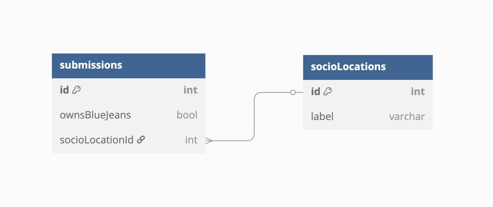
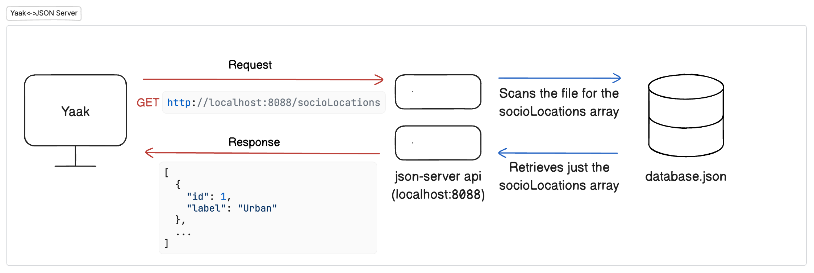
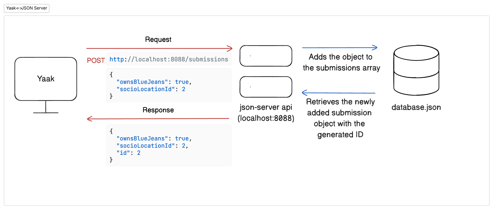

# Your own API with JSON-Server

In the previous chapter, we learned about Dr. Henrietta Jones and her research project on blue jeans. Now, we need to <analogy>create</analogy> a database to store the survey data.

Let's look at the <analogy>ERD</analogy> for our Indiana Jeans survey:



This diagram shows:
- Two tables: `submissions` and `socioLocations`
- A <analogy>one-to-many relationship</analogy>: Many submissions can reference one socioLocation
- The <analogy>Foreign Key</analogy> `socioLocationId` in the submissions table connects to the <analogy>Primary Key</analogy> `id` in the socioLocations table

## Introduction to JSON Database

For our <analogy>client</analogy>-side applications, we will be using a <analogy>JSON</analogy> file to simulate a structured database, similar to what you'd <analogy>find</analogy> in a real-world application. While it won't have the full capabilities of a relational database like PostgreSQL or MySQL (we'll set up one of these in the <analogy>server</analogy>-side portion of this course), it will allow us to work with data in a way that mimics how a backend stores and retrieves information.

> <analogy>JSON</analogy> (JavaScript <analogy>Object</analogy> Notation) is a lightweight data format that's easy for humans to <analogy>read</analogy> and write, and easy for machines to parse and generate.

Our <analogy>ERD</analogy> acts as a blueprint for this database. It has defined each table (or in the case for our <analogy>JSON</analogy> file, each <analogy>array</analogy>) and each row in the tables (properties for each <analogy>object</analogy> in the tables)

In this project, we'll use a <analogy>JSON</analogy> file to store:
1. Survey submissions (who owns blue jeans and where they live)
2. Predefined socioeconomic locations (Urban, Suburban, etc.)

## Setting Up the JSON Database

In `database.json` in your project's `api` <analogy>directory</analogy> and add the following <analogy>JSON</analogy> content:

```json
{
  "submissions": [
    {
      "id": 1,
      "ownsBlueJeans": false,
      "socioLocationId": 1
    }
  ],
  "socioLocations": [
    {
      "id": 1,
      "label": "Urban"
    },
    {
      "id": 2,
      "label": "Suburban"
    },
    {
      "id": 3,
      "label": "Semi-Rural"
    },
    {
      "id": 4,
      "label": "Rural"
    }
  ]
}
```

This <analogy>JSON</analogy> file contains:
- An <analogy>array</analogy> of `submissions` with one sample submission
- An <analogy>array</analogy> of `socioLocations` with four options for survey respondents

## Introducing JSON Server API

Now that we have our database file, we need a way to interact with it. For this, we'll use **<analogy>JSON</analogy> <analogy>Server</analogy>**, a simple tool that allows us to interact with our <analogy>JSON</analogy> file with an <analogy>API</analogy>.

### What is JSON Server?

<analogy>JSON</analogy> <analogy>Server</analogy> is a Node.js package that allows you to <analogy>create</analogy> a fake <analogy>API</analogy> with zero coding. It uses a <analogy>JSON</analogy> file as the database and automatically generates [endpoints](./FD_INTRO_TO_API.md#-key-concepts-to-remember) to access and modify that data.

### Installing JSON Server

You should already have <analogy>json-server</analogy> installed. Check this by running the following command in your <analogy>terminal</analogy>:

```sh
json-server --version
```

You should see `0.17.3` as the output. 

If you get a different version output or an error, run the following commands in your <analogy>terminal</analogy>:

```sh
npm uninstall -g json-server
npm install -g json-server@0.17.4
```

Run the `json-server --version` command in your <analogy>terminal</analogy> once more. If you *still* do not see `0.17.3`, ask an instructor for help.

### Starting JSON Server

Open a new tab in your <analogy>terminal</analogy>. (`cmd + t` or `ctrl + t`) Navigate to the `api` <analogy>directory</analogy> in your project and run:

```sh
json-server -p 8088 -w database.json
```

This command:
- Starts <analogy>JSON</analogy> <analogy>Server</analogy> on port 8088
- Watches (-w) the database.<analogy>json</analogy> file for changes
- Creates endpoints based on the top-level keys in your <analogy>JSON</analogy> file

You should see output similar to:

```
\{^_^}/ hi!

  Loading database.json
  Done
```

<analogy>JSON</analogy> <analogy>server</analogy> will also list the available endpoints it made based on your <analogy>JSON</analogy> file.

```sh
Resources
  http://localhost:8088/submissions
  http://localhost:8088/socioLocations
```

## Testing the API with Yaak

Now let's use Yaak to test our <analogy>API</analogy> and see how it works.

### Making a GET Request

First, let's retrieve all the socioLocations from our database:

1. Open Yaak
2. <analogy>Create</analogy> a new <analogy>HTTP</analogy> <analogy>request</analogy> 
3. Set the method to `GET`
4. Enter the <analogy>endpoint</analogy> for `socioLocations` (take a look at the <analogy>terminal</analogy> output from <analogy>json-server</analogy> if you're unsure what the <analogy>endpoint</analogy> is)
5. Hit enter or click ➤ (send)

***Well looky here!***

You should have received a <analogy>response</analogy> with a <analogy>status code</analogy> of `200 OK` and a <analogy>JSON</analogy> <analogy>array</analogy> containing all four socioLocations. This data should look pretty familiar! It's the socioLocation data we added to the `database.json` file. 🎉 Yaak made an <analogy>HTTP</analogy> <analogy>GET</analogy> <analogy>request</analogy> to the <analogy>JSON</analogy> <analogy>server</analogy> <analogy>api</analogy> we spun up on localhost:8088. The <analogy>JSON-server</analogy> <analogy>api</analogy> retrieved the socioLocations from our <analogy>JSON</analogy> "database". The <analogy>JSON-server</analogy> <analogy>api</analogy> then returned the socioLocations back to Yaak in the <analogy>HTTP</analogy> <analogy>response</analogy>. Let's see that in color:



### Understanding the POST Method

While the <analogy>GET</analogy> method *retrieves* data, the <analogy>POST</analogy> method allows us to *<analogy>create</analogy>* new data. Here's how it works:

1. The <analogy>client</analogy> sends a <analogy>POST</analogy> <analogy>request</analogy> with new data in the **<analogy>request body</analogy>**
2. The <analogy>api</analogy> processes the <analogy>request</analogy> and adds the data to the database
3. The <analogy>api</analogy> responds with the newly created data, including an auto-generated ID

### Making a POST Request

Let's <analogy>create</analogy> a new survey submission:

1. In Yaak, <analogy>create</analogy> a new <analogy>HTTP</analogy> <analogy>request</analogy>
2. Set the method to `POST`
3. Enter the <analogy>endpoint</analogy> for `submissions` (take a look at the <analogy>terminal</analogy> output from <analogy>json-server</analogy> if you're unsure what the <analogy>endpoint</analogy> is)
4. Click the **Body** <analogy>dropdown</analogy> and <analogy>select</analogy> `JSON`. This is the type of data we are sending in our <analogy>request</analogy>.
5. In the <analogy>request body</analogy>, add:
   ```json
   {
     "ownsBlueJeans": true,
     "socioLocationId": 2
   }
   ```
   This is the submission we want to add to the database.
6. Hit enter or click ➤

You should receive a <analogy>response</analogy> with:
- <analogy>Status code</analogy> 201 (Created)
- A <analogy>JSON</analogy> <analogy>object</analogy> of your new submission, now with an auto-generated ID

To verify the submission was saved, make a <analogy>GET</analogy> <analogy>request</analogy> to the `submissions` <analogy>endpoint</analogy>. You should see both the original submission and your new one.

Let's break down what happened again: Yaak made an <analogy>HTTP</analogy> <analogy>POST</analogy> <analogy>request</analogy> to the <analogy>JSON</analogy> <analogy>server</analogy> <analogy>api</analogy> we spun up on localhost:8088, sending along the data for a new submission in the <analogy>request body</analogy>. The <analogy>JSON-server</analogy> <analogy>api</analogy> received this data and added it to our <analogy>JSON</analogy> 'database' in the submissions <analogy>array</analogy>. The <analogy>JSON-server</analogy> <analogy>api</analogy> then returned the newly created submission (now with an ID) back to Yaak in the <analogy>HTTP</analogy> <analogy>response</analogy>. Let's see that in color:



## 📓 Key Concepts to Remember

1. **<analogy>JSON</analogy> Database**: A simple file-based way to store structured data for <analogy>client</analogy>-side applications, organized as arrays of objects.

2. **<analogy>JSON</analogy> <analogy>Server</analogy>**: A Node.js tool that creates an <analogy>API</analogy> from a <analogy>JSON</analogy> file without requiring backend code.

3. **<analogy>API</analogy> Endpoints**: URLs that your application can interact with to perform <analogy>CRUD</analogy> (<analogy>Create</analogy>, <analogy>Read</analogy>, <analogy>Update</analogy>, <analogy>Delete</analogy>) operations on your data.

4. **<analogy>HTTP</analogy> Methods**:
   - **<analogy>GET</analogy>**: Retrieves data from the <analogy>server</analogy>
   - **<analogy>POST</analogy>**: Creates new data on the <analogy>server</analogy>

5. **Status Codes**:
   - **200 OK**: Successful <analogy>GET</analogy> <analogy>request</analogy>
   - **201 Created**: Successful <analogy>POST</analogy> <analogy>request</analogy>

6. **<analogy>Request Body</analogy>**: Data sent to the <analogy>server</analogy> in a <analogy>POST</analogy> <analogy>request</analogy>, typically in <analogy>JSON</analogy> format.

7. **Relational Data**: Connecting data between tables using foreign keys (like linking submissions to socioLocations).

## 🎓 Practice Exercise

1. Use Yaak to make another <analogy>POST</analogy> <analogy>request</analogy> to add a new submission with:
   - `ownsBlueJeans`: false
   - `socioLocationId`: 3
2. Verify it was added by making a <analogy>GET</analogy> <analogy>request</analogy> to `/submissions`
3. 🧭 **Explorer Exercise**: <analogy>Try</analogy> making a <analogy>GET</analogy> <analogy>request</analogy> to `/submissions/2` to retrieve just the second submission
4. 🏕 **Pioneer Exercise**: <analogy>Try</analogy> making a <analogy>GET</analogy> <analogy>request</analogy> to `/submissions?_expand=socioLocation` - What's different about the <analogy>response</analogy>?

## 📝 What We've Learned

In this chapter, we've:
- Created a <analogy>JSON</analogy> database file
- Started a <analogy>JSON</analogy> <analogy>Server</analogy> to <analogy>create</analogy> an <analogy>API</analogy>
- Learned about the <analogy>POST</analogy> <analogy>HTTP</analogy> method
- Used Yaak to test our <analogy>API</analogy> endpoints


## 🔜 Next Steps

In the upcoming chapters, we'll build the <analogy>client</analogy>-side interface for our survey, allowing users to <analogy>select</analogy> from radio buttons and submit their responses to our <analogy>API</analogy>.

Up Next: [Creating a <analogy>Radio Button</analogy> <analogy>Component</analogy>](./IJ_JEANS_COMPONENT.md)