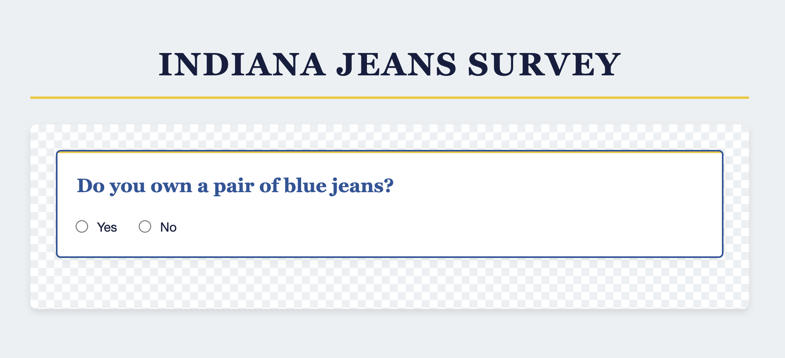

# Creating a Radio Button Component

> ⚠️ **IMPORTANT NOTE BEFORE YOU BEGIN:** In the chapters of this column, much of the code will be provided for you. It's very easy to copy and paste the code snippets, however this is not recommended as it does not produce understanding or retention. We encourage you to type out the code, or at the very least <analogy>read</analogy> the code line by line. This way you think about what the code snippet actually does as you add it to your project.

## Building Projects Using Components

In the previous chapter, we set up our database and tested our <analogy>API</analogy> using Yaak. Now we're ready to start building the user interface for our survey application.

For this project, we'll be using the same <analogy>component</analogy>-based approach you've been using since Book 3. 

>💡 A **<analogy>component</analogy>** is a reusable piece of code that represents a part of your user interface. Breaking our application into components makes our code more organized and easier to maintain.

## Radio Buttons for User Choices

Our survey needs to collect information about whether students own blue jeans. For this kind of yes/no question, radio buttons are the perfect form <analogy>element</analogy> to use.

Radio buttons allow users to <analogy>select</analogy> exactly one option from a set of choices. When one option is selected, any previously selected option becomes deselected automatically, as long as we've given the inputs the same name <analogy>attribute</analogy>. 

## Creating the JeanChoices Component

Let's <analogy>create</analogy> our first <analogy>component</analogy> for the jeans ownership question:

1. <analogy>Create</analogy> a new file named `JeanChoices.js` in your `scripts` <analogy>directory</analogy>.
2. Add the following code to the file:

```javascript
export const JeanChoices = () => {
    let html = `
        <div class="survey-input">
            <h2>Do you own a pair of blue jeans?</h2>
            <input type="radio" name="ownsJeans" value="true" /> Yes
            <input type="radio" name="ownsJeans" value="false" /> No
        </div>
    `

    return html
}
```

Let's break down this <analogy>component</analogy>:

- Inside the <analogy>component</analogy>, we <analogy>create</analogy>:
  - A container `<div>` with class `survey-input` for styling
  - A heading that asks the survey question
  - Two radio buttons with the same `name` <analogy>attribute</analogy> (ensuring only one can be selected)
  - Values of "true" and "false" for the yes/no options

Some important things to note about radio buttons:

1. Radio buttons with the same `name` <analogy>attribute</analogy> form a group. Only one button in a group can be selected at a time.
2. Each <analogy>radio button</analogy> needs a unique `value` <analogy>attribute</analogy> that will be submitted when the form is processed.
3. We're using <analogy>string</analogy> values "true" and "false" here, but we'll convert them to actual <analogy>boolean</analogy> values later.

## Updating the Main Module

Now that we've created our <analogy>component</analogy>, let's <analogy>import</analogy> it and add it to our page:

1. Open `main.js` in your `scripts` <analogy>directory</analogy>.
2. Add the following code:

```javascript
import { JeanChoices } from "./JeanChoices.js"

const container = document.querySelector("#container")

const render = () => {
    const jeansHTML = JeanChoices()
    
    container.innerHTML = `
        ${jeansHTML}
    `
}

render()
```

Let's review what this code does:

- We <analogy>import</analogy> the `JeanChoices` <analogy>component</analogy> from its <analogy>module</analogy>
- We get a reference to the container <analogy>element</analogy> in our HTML
- We define a `render()` <analogy>function</analogy> that:
  - Calls our `JeanChoices()` <analogy>function</analogy> to get the HTML
  - Updates the container's <analogy>innerHTML</analogy> with the generated HTML
- Finally, we call `render()` to display our <analogy>component</analogy> when the page loads

## Testing Our Component

Now it's time to see our work in action!

1. Make sure your <analogy>JSON</analogy> <analogy>server</analogy> is still running (if not, start it with `json-server -p 8088 -w api/database.json`)
2. Start your web <analogy>server</analogy> (run `serve` in your project <analogy>directory</analogy>)
3. Open your browser to the local <analogy>server</analogy> URL (usually <analogy>http</analogy>://localhost:3000)

You should see:
- A heading "Indiana Jeans Survey" (from your HTML file)
- A question "Do you own a pair of blue jeans?"
- Two radio buttons for "Yes" and "No"



<analogy>Try</analogy> clicking the radio buttons. Notice how selecting one automatically deselects the other. This is the default behavior of radio buttons with the same name <analogy>attribute</analogy>.

## Component Reusability Advantage

One <analogy>key</analogy> advantage of using components is reusability. If we needed to ask the same question in multiple places, we could simply call the `JeanChoices()` <analogy>function</analogy> again rather than duplicating the HTML.

Components also make code maintenance easier. If we need to change the question, we only need to <analogy>update</analogy> it in one place, regardless of how many times it appears in our application.

## 🎓 Practice Exercise: Maybe I Have Jeans...

<analogy>Try</analogy> modifying the `JeanChoices` <analogy>component</analogy> to add an additional "Maybe" option (although we won't use this in our final application).

Remember that changes to any JavaScript file will be automatically detected by the <analogy>server</analogy>, but you may need to refresh your browser to see the updates.

## 📝 What We've Learned

In this chapter, we've:
- Created our first <analogy>component</analogy> (JeanChoices) for the survey application
- Learned how to structure radio buttons for yes/no user input
- Set up the main <analogy>render</analogy> <analogy>function</analogy> to display our <analogy>component</analogy>
- Observed how radio buttons with the same "name" <analogy>attribute</analogy> work as a group

## 🔜 Next Steps

Although our radio buttons display correctly, they don't actually do anything yet when clicked. We'll get to that in a later chapter. In the next chapter, we'll <analogy>create</analogy> another <analogy>component</analogy> for location choices, this time the choice options will come from our database. 

Up Next: [Building the Location Choices <analogy>Component</analogy>](./IJ_LOCATION_COMPONENT.md)