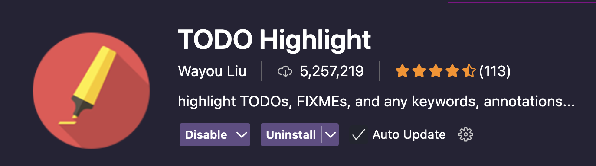
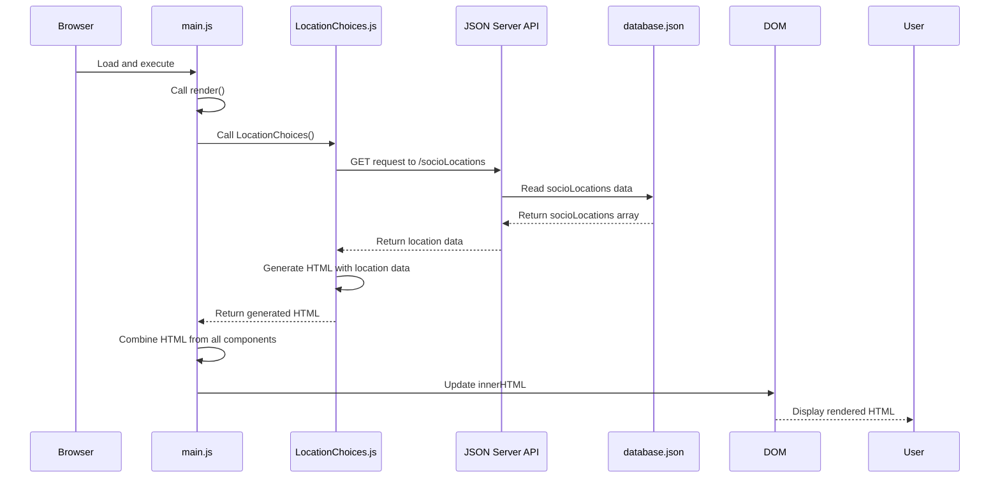
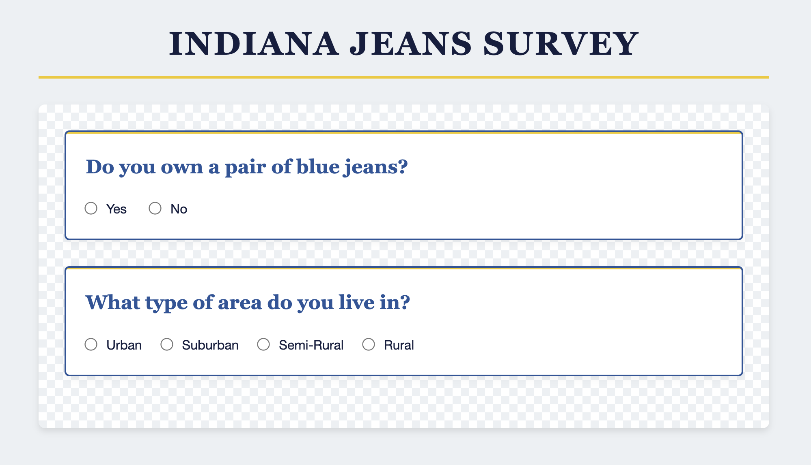

# Building the Location Choices Component

In the previous chapter, we created our first <analogy>component</analogy> with static radio buttons for the jeans ownership question. Now, we'll take our application to the next level by creating a <analogy>component</analogy> that dynamically builds radio buttons based on data from our <analogy>API</analogy>.

This is a <analogy>key</analogy> concept in modern web development: instead of hardcoding options in our HTML, we'll fetch the available choices from our database and generate the HTML programmatically. This approach makes our application more flexible and easier to maintain.

> ⚠️ **REMEMBER:** Simply copying and pasting the provided code snippets is not recommended as it does not produce understanding or retention. We encourage you to type out the code, or at the very least <analogy>read</analogy> the code line by line. This way you think about what the code snippet actually does as you add it to your project. If at any point the code doesn't make sense to you, revisit the Fox y Cat chapters to brush up on promises and async/<analogy>await</analogy>.

## Creating the LocationChoices Component

Let's <analogy>create</analogy> a new <analogy>component</analogy> for asking users about the type of area they live in:

1. <analogy>Create</analogy> a new file called `LocationChoices.js` in your `scripts` <analogy>directory</analogy>
2. Let's add the basic structure for our <analogy>component</analogy>:

```javascript
export const LocationChoices = () => {
   // TODO: Fetch locations from the API
    
    let html = `
        <div class="survey-input">
            <h2>What type of area do you live in?</h2>
    `
    
    // TODO: generate radio buttons and add to html

    html += `
        </div>
    `
    
    return html
}
``` 

> 💡 **FUN TIP:** 
> |  | ***TODO Highlight*** is a fun vscode <analogy>extension</analogy> that automatically highlights the text `TODO:` in your editor. |
> |-|-|

## Fetching Data from the JSON Server API

Now, let's add the code to fetch the location choices from our <analogy>API</analogy>:

```javascript
export const LocationChoices = async () => {
    const response = await fetch("http://localhost:8088/socioLocations")
    const locations = await response.json()

    let html = `
        <div class="survey-input">
            <h2>What type of area do you live in?</h2>
    `
    
    // TODO: generate radio buttons and add to html

    html += `
        </div>
    `

    return html
}
```

In this code, we:
1. Make a <analogy>GET</analogy> <analogy>request</analogy> to our <analogy>JSON</analogy> <analogy>Server</analogy> <analogy>API</analogy> <analogy>endpoint</analogy> for socioLocations
2. Wait for the <analogy>response</analogy> (`fetch()` is <analogy>asynchronous</analogy>)
3. Convert the <analogy>response</analogy> to a JavaScript <analogy>object</analogy> using `.json()` and wait for the converted data (`.json()` is <analogy>asynchronous</analogy>)
4. Store the locations in a <analogy>variable</analogy> that we'll use to generate our radio buttons

Notice that we've marked our <analogy>function</analogy> as `async`. This is because we had to <analogy>await</analogy> our `fetch()` and `.json()` operations.

## Updating the Main Module

Though we have not generated our radio buttons yet, let's go ahead and <analogy>update</analogy> our `main.js` file to include our new <analogy>component</analogy>, this way we can <analogy>invoke</analogy> the <analogy>function</analogy> and view the <analogy>request</analogy> in the <analogy>network tab</analogy> to confirm everything is working properly. It's very important to continually test your code as you implement it. 

See if you can do this on your own. Expand the hints below if you need some help.

<details>
    <summary>💡 <analogy>Algorithm</analogy></summary>

1. <analogy>Import</analogy> the new `LocationChoices` <analogy>component</analogy>
2. <analogy>Invoke</analogy> `LocationChoices` in the <analogy>render</analogy> <analogy>function</analogy> using the `await` keyword since this <analogy>function</analogy> is defined as `async` and therefore returns a <analogy>promise</analogy>.
3. Store the returned html in a <analogy>variable</analogy>
5. Make the `render` <analogy>function</analogy> `async` since it invokes an <analogy>async function</analogy>
6. Add the `locationsHTML` to the container
</details>

<details>
    <summary>💡 Code</summary>

```javascript
import { JeanChoices } from "./JeanChoices.js"
import { LocationChoices } from "./LocationChoices.js"

const container = document.querySelector("#container")

const render = async () => {
    const jeansHTML = JeanChoices()
    const locationsHTML = await LocationChoices()
    
    container.innerHTML = `
        ${jeansHTML}
        ${locationsHTML}
    `
}

render()
```
</details>

## Examining Network Requests with the Network Tab

Let's examine what happens behind the scenes when we make this fetch <analogy>request</analogy>. 

To view your <analogy>request</analogy>:
1. Open the <analogy>developer tools</analogy> 
2. Click on the "Network" tab
3. Choose `Fetch/XHR` to reduce some of the noise
4. Refresh the page to see the requests

When the `LocationChoices` <analogy>component</analogy> runs, you'll see a <analogy>request</analogy> to `socioLocations` in the <analogy>Network tab</analogy>. Clicking on this <analogy>request</analogy> reveals:

- **Headers**: Contains information about the <analogy>request</analogy>, including:
  - URL: <analogy>http</analogy>://localhost:8088/socioLocations
  - Method: <analogy>GET</analogy>
  - <analogy>Status Code</analogy>: 200 OK (indicating success)

- **Preview/<analogy>Response</analogy>**: Shows the actual data returned from the <analogy>server</analogy>, which should be an <analogy>array</analogy> of location objects like:
  ```json
  [
    {
      "id": 1,
      "label": "Urban"
    },
    {
      "id": 2,
      "label": "Suburban"
    },
    ...
  ]
  ```

This visual inspection helps you understand:
- If your <analogy>request</analogy> was successful
- What data you received
- How it's structured (now we know which properties to access to generate our radio buttons)

## Generating Radio Buttons Dynamically

Now that we have our locations data and we understand the structure of the data, let's generate a <analogy>radio button</analogy> for each location option:

```javascript
export const LocationChoices = async () => {
    const response = await fetch("http://localhost:8088/socioLocations")
    const locations = await response.json()
    
    let html = `
        <div class="survey-input" id="location-choice">
            <h2>What type of area do you live in?</h2>
    `

    for (const location of locations) {
        html += `<input type="radio" name="location" value="${location.id}" /> ${location.label}`
    }
    
    html += `
        </div>
    `
    
    return html
}
```

In this code, we:
1. Use a `for...of` loop to iterate through each location in our <analogy>array</analogy>
2. For each location, we generate an HTML <analogy>string</analogy> for a <analogy>radio button</analogy>:
   - The `name` <analogy>attribute</analogy> is set to "location" for all buttons (making them work as a group)
   - The `value` <analogy>attribute</analogy> is set to the location's ID (which we'll use later to store the user's choice)
   - After the <analogy>radio button</analogy>, we display the location's label

## The System at Work

Let's visualize what's happening in our application with a <analogy>sequence diagram</analogy>:



1. The browser loads `main.js`, which calls `render()`
2. `render()` calls `LocationChoices()`
3. `LocationChoices()` makes a <analogy>GET</analogy> <analogy>request</analogy> to the <analogy>JSON</analogy> <analogy>Server</analogy> <analogy>API</analogy>
4. The <analogy>JSON</analogy> <analogy>Server</analogy> <analogy>API</analogy> reads data from database.<analogy>json</analogy>
5. `database.json` returns the `socioLocations` <analogy>array</analogy>
6. The <analogy>API</analogy> returns the location data to `LocationChoices()`
7. `LocationChoices()` generates HTML with the data and returns it
8. `render()` combines the HTML from all components and updates the <analogy>DOM</analogy>
9. The user sees the rendered HTML in the browser

## The Rendered Component

You should now see:
- The "Do you own a pair of blue jeans?" question with Yes/No options
- A new question "What type of area do you live in?" with four <analogy>radio button</analogy> options: Urban, Suburban, Semi-Rural, and Rural



## 📓 Key Concepts to Remember

1. **Async/<analogy>Await</analogy>**: When functions make <analogy>API</analogy> calls, they should be marked as `async` and use `await` for <analogy>asynchronous</analogy> operations
2. **Fetch <analogy>API</analogy>**: Used to make <analogy>HTTP</analogy> requests to your backend <analogy>API</analogy>
3. **Dynamic HTML Generation**: Using JavaScript to <analogy>create</analogy> HTML based on data from an <analogy>API</analogy>
4. **<analogy>Network Tab</analogy>**: A developer tool that allows you to inspect <analogy>HTTP</analogy> requests and responses
5. **<analogy>Radio Button</analogy> Groups**: Radio buttons with the same `name` <analogy>attribute</analogy> work as a group where only one can be selected

## 🎓 Practice Exercise: Dr. Jones' Research Expansion

Dr. Jones has rushed into your office with exciting news! Her research grant has been expanded to include metropolitan areas, and she needs you to <analogy>update</analogy> the survey right away.

"I need to add 'Metropolitan' as a new location category before my presentation tomorrow," she explains, adjusting her iconic hat. "The urban/rural spectrum is incomplete without it!"

Where should you make this change?

## 📝 What We've Learned

In this chapter, we've:
- Created a new <analogy>component</analogy> that fetches data from our <analogy>API</analogy>
- Used the `async/await` syntax for handling <analogy>asynchronous</analogy> <analogy>API</analogy> calls
- Generated HTML dynamically based on data from the database
- Used the browser's <analogy>Network tab</analogy> to inspect <analogy>HTTP</analogy> requests and responses
- Updated our main <analogy>render</analogy> <analogy>function</analogy> to include multiple components

## 🔜 Next Steps

Our radio buttons now appear correctly but they don't actually capture the user's choices yet. In the next chapter, we'll learn about "<analogy>transient state</analogy>" - a way to temporarily store user selections before saving them to the database. We'll add <analogy>event</analogy> listeners to our radio buttons to capture the user's choices and store them in this <analogy>transient state</analogy>.
