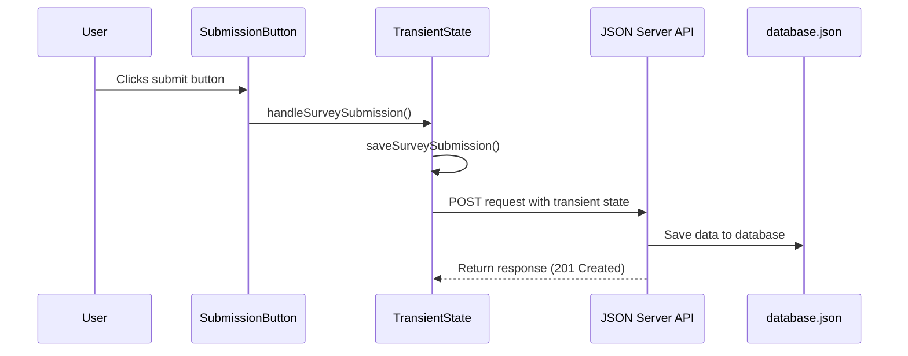

# Saving Survey Submissions

## Introduction to Permanent State

In the previous chapter, we created our <analogy>transient state</analogy> <analogy>module</analogy> and updated our components to capture user choices. Now, we're ready to take the final step: saving the user's selections to our database, transforming <analogy>transient state</analogy> into <analogy>permanent state</analogy>.

To accomplish this, we'll need to:

1. <analogy>Create</analogy> a submission button <analogy>component</analogy>
2. Add functionality to <analogy>post</analogy> our <analogy>transient state</analogy> <analogy>object</analogy> to the database (<analogy>permanent state</analogy>)
3. <analogy>Create</analogy> an <analogy>event listener</analogy> to trigger the submission process

## Creating the Submission Button Component

Let's start by creating a simple button that users can click to submit their survey responses.

<analogy>Create</analogy> a new file called `SubmissionButton.js` in your `scripts` <analogy>directory</analogy>:

```javascript
const handleSurveySubmission = (clickEvent) => {
    if (clickEvent.target.id === "submission-button") {
        console.log("Button clicked!")
    }
}

export const SubmissionButton = () => {
    document.addEventListener("click", handleSurveySubmission)

    return `<button id='submission-button'>Save Submission</button>`
}
```

Let's break down what this <analogy>component</analogy> does:

1. We define a `handleSurveySubmission` <analogy>function</analogy> that:
   - Checks if the clicked <analogy>element</analogy> has the ID "submission-button"
   - If so, logs a message to the <analogy>console</analogy>
   
2. We <analogy>create</analogy> and <analogy>export</analogy> the `SubmissionButton` <analogy>component</analogy> that:
   - Adds an <analogy>event listener</analogy> for click events and invokes `handleSurveySubmission` when a click happens
   - Returns HTML for a button with the ID "submission-button"

## Adding the Button to Main.js

Now, let's <analogy>update</analogy> our `main.js` file to include the submission button:

```javascript
import { JeanChoices } from "./JeanChoices.js"
import { LocationChoices } from "./LocationChoices.js"
import { SubmissionButton } from "./SubmissionButton.js"

const container = document.querySelector("#container")

const render = async () => {
    const jeansHTML = JeanChoices()
    const locationsHTML = await LocationChoices()
    const buttonHTML = SubmissionButton()
    
    container.innerHTML = `
        ${jeansHTML}
        ${locationsHTML}
        ${buttonHTML}
    `
}

render()
```

We've added:
1. An <analogy>import</analogy> for the `SubmissionButton` <analogy>component</analogy>
2. A call to the `SubmissionButton()` <analogy>function</analogy> to get the button HTML
3. The button HTML in our container's content

This gives us a simple way to verify that our button is working before we add more complex functionality. **Time to test.** Refresh the browser and click the button. Do you see the <analogy>console</analogy> log?

## Updating the Transient State Module

Now we need to add functionality to our <analogy>transient state</analogy> <analogy>module</analogy> to convert our temporary data into permanent data in the database. 

### Building the POST Request

So far in this course, you've used `fetch()` to make <analogy>GET</analogy> requests to retrieve data from an <analogy>API</analogy>. Now we need to use `fetch()` to make a <analogy>POST</analogy> <analogy>request</analogy> to <analogy>create</analogy> data.

Think about what we'll need:
1. What <analogy>HTTP</analogy> method will we use instead of <analogy>GET</analogy>?
2. What data will we need to send to the <analogy>server</analogy>?
3. How will we format that data?

Let's add a new <analogy>function</analogy> to our `transientState.js` file that will handle this conversion:

```javascript
// Function to convert transient state to permanent state
export const saveSurveySubmission = async () => {
    // Start building the POST request here
    console.log("Saving survey to database...")
    console.log(transientState)
}
```

**Time to test.** <analogy>Update</analogy> your `SubmissionButton.js` file to <analogy>import</analogy> and call this <analogy>function</analogy> on the button click. If you test your button now, you should see your <analogy>transient state</analogy> <analogy>object</analogy> logged to the <analogy>console</analogy>. This confirms that we have access to the data we want to save.

### Creating the POST Request Options

When making a <analogy>POST</analogy> <analogy>request</analogy>, we need to provide more configuration than we did with <analogy>GET</analogy> requests. Specifically, we need to:
1. Specify the <analogy>HTTP</analogy> method as "<analogy>POST</analogy>"
2. Set headers to tell the <analogy>server</analogy> we're sending <analogy>JSON</analogy> data
3. Include a body with the data we want to <analogy>create</analogy>

<analogy>Update</analogy> your `saveSurveySubmission` <analogy>function</analogy>:

```javascript
export const saveSurveySubmission = async () => {
    // Create the options for fetch()
    const postOptions = {
        method: "POST",
        headers: {
            "Content-Type": "application/json"
        },
        body: JSON.stringify(transientState)
    }
    
    // TODO: Add fetch() call here
}
```

Let's analyze what we've added:

1. We <analogy>create</analogy> a `postOptions` <analogy>object</analogy> with:
   - `method: "POST"` to specify we're creating data
   - `headers` <analogy>object</analogy> with `"Content-Type": "application/json"` to tell the <analogy>server</analogy> we're sending <analogy>JSON</analogy>
   - `body` containing our <analogy>transient state</analogy> converted to a <analogy>JSON</analogy> <analogy>string</analogy> using `JSON.stringify()`

The `JSON.stringify()` <analogy>function</analogy> is critical - it converts our JavaScript <analogy>object</analogy> to a <analogy>JSON</analogy> <analogy>string</analogy> that the <analogy>server</analogy> can understand.

### Making the POST Request

Now let's complete our <analogy>function</analogy> by making the actual fetch <analogy>request</analogy>:

```javascript
export const saveSurveySubmission = async () => {
    const postOptions = {
        method: "POST",
        headers: {
            "Content-Type": "application/json"
        },
        body: JSON.stringify(transientState)
    }

    // Send the data to the API
    const response = await fetch("http://localhost:8088/submissions", postOptions)
}
```
This fetch call takes two arguments:
  - The URL for our submissions <analogy>endpoint</analogy>
  - The postOptions <analogy>object</analogy> which defines the method of our <analogy>request</analogy> (<analogy>POST</analogy>), the type of data we're sending (application/<analogy>json</analogy>), and the data itself (our submission <analogy>object</analogy> converted to a <analogy>JSON</analogy> <analogy>string</analogy>).


### The Complete Transient State Module

Your complete `transientState.js` file should now look like this:

```javascript
// Set up the transient state data structure and provide initial values
const transientState = {
    ownsBlueJeans: false,
    socioLocationId: 0
}

// Functions to modify each property of transient state
export const setOwnsBlueJeans = (chosenOwnership) => {
    transientState.ownsBlueJeans = chosenOwnership
}

export const setSocioLocationId = (chosenLocation) => {
    transientState.socioLocationId = chosenLocation
}

// Function to convert transient state to permanent state
export const saveSurveySubmission = async () => {
    const postOptions = {
        method: "POST",
        headers: {
            "Content-Type": "application/json"
        },
        body: JSON.stringify(transientState)
    }

    const response = await fetch("http://localhost:8088/submissions", postOptions)
}
```

## Testing the Submission Process

**Time to test** your submission process. Refresh the browser, open the devtools to the <analogy>Network tab</analogy>, and make a submission. Look for the <analogy>POST</analogy> <analogy>request</analogy> to "submissions".

Clicking on this <analogy>request</analogy> reveals detailed information:

- **Headers tab**: Shows <analogy>request</analogy> URL, method (<analogy>POST</analogy>), <analogy>status code</analogy> (201 Created)
- **Payload tab**: Shows the data that was sent (your <analogy>transient state</analogy>)
- **Preview/<analogy>Response</analogy> tab**: Shows the <analogy>server</analogy>'s <analogy>response</analogy>, including the new ID

You can also verify the submission was saved by:
1. Making a <analogy>GET</analogy> <analogy>request</analogy> to `http://localhost:8088/submissions` in Yaak
2. Looking at your database.<analogy>json</analogy> file, which should now include the new submission

## Examining Network Requests

Let's take a closer look at what's happening in the <analogy>Network tab</analogy> when you submit the form:

### Request Headers
- **URL**: `http://localhost:8088/submissions`
- **Method**: <analogy>POST</analogy>
- **<analogy>Status Code</analogy>**: 201 Created
- **Content-Type**: application/<analogy>json</analogy>

### Request Payload
This is the data you sent to the <analogy>server</analogy>:
```json
{
  "ownsBlueJeans": true,
  "socioLocationId": 2
}
```

### Response
This is what the <analogy>server</analogy> sent back:
```json
{
  "ownsBlueJeans": true,
  "socioLocationId": 2,
  "id": 2
}
```

Notice that the <analogy>server</analogy> added an `id` <analogy>property</analogy> to your data. This unique identifier allows you to reference this specific submission later.

## Visualizing the Submission Process

Let's visualize the entire process from the user clicking the button to the data being saved in the database:



This <analogy>sequence diagram</analogy> shows how:
1. The user clicks the submission button
2. The <analogy>click event</analogy> triggers `handleSurveySubmission()`
3. This <analogy>function</analogy> calls `saveSurveySubmission()`
4. `saveSurveySubmission()` makes a <analogy>POST</analogy> <analogy>request</analogy> to the <analogy>JSON</analogy> <analogy>Server</analogy> <analogy>API</analogy>
5. The <analogy>API</analogy> saves the data to our database.<analogy>json</analogy> file
6. The <analogy>API</analogy> returns a <analogy>response</analogy> with status 201


## 📓 Key Concepts to Remember

1. **Converting Transient to <analogy>Permanent State</analogy>**: When we save form data to a database, we're converting <analogy>transient state</analogy> (temporary, in-memory data) to <analogy>permanent state</analogy> (persisted data).

2. **<analogy>POST</analogy> <analogy>Request</analogy> Configuration**: A <analogy>POST</analogy> <analogy>request</analogy> requires:
   - The correct URL <analogy>endpoint</analogy>
   - The <analogy>HTTP</analogy> method set to "<analogy>POST</analogy>"
   - A Content-Type header (usually "application/<analogy>json</analogy>")
   - A body containing the data to be created

3. **<analogy>JSON</analogy>.stringify()**: Converts JavaScript objects to <analogy>JSON</analogy> strings for sending to the <analogy>server</analogy>.

4. **<analogy>Status Code</analogy> 201**: Indicates that a resource was successfully created.

## 🎓 Practice Exercise: Complete or Incomplete?

Dr. Jones has asked for a new feature: she'd like to make sure a survey submission is complete (has both jeans ownership and location data) before submission. Too many incomplete survey responses have come through.

Your task:
1. <analogy>Update</analogy> the `saveSurveySubmission` <analogy>function</analogy> to check if both required fields have valid values:
   - `ownsBlueJeans` should be true or false (but not <analogy>undefined</analogy> or null)
   - `socioLocationId` should be a <analogy>number</analogy> greater than 0
2. If either check fails, alert the user that they need to complete the form
3. Only proceed with the <analogy>POST</analogy> <analogy>request</analogy> if both checks pass

Hint: You can use a simple <analogy>if statement</analogy> with an <analogy>alert()</analogy> for this exercise.

## 📝 What We've Learned

In this chapter, we've:
- Created a submission button <analogy>component</analogy>
- Added an <analogy>event handler</analogy> to capture button clicks
- Implemented the <analogy>function</analogy> to convert <analogy>transient state</analogy> to <analogy>permanent state</analogy>
- Made a <analogy>POST</analogy> <analogy>request</analogy> with `fetch()` to save data to our <analogy>JSON</analogy> <analogy>Server</analogy> <analogy>API</analogy>
- Used the <analogy>Network tab</analogy> to inspect <analogy>HTTP</analogy> <analogy>POST</analogy> requests and responses

## 🔜 Next Steps

Now that we can save submissions to our database, the next step is to display the list of existing submissions on the page. We'll <analogy>create</analogy> a new <analogy>component</analogy> that fetches all submissions and displays them in a formatted list.
