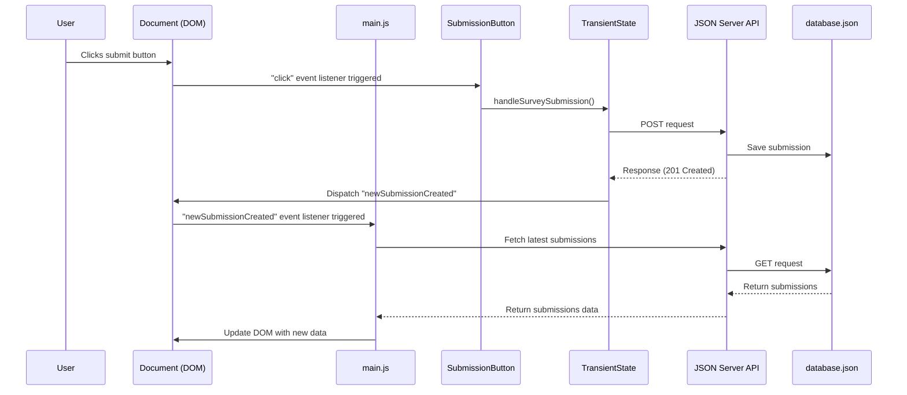

# Reacting To State Changes

## The Re-render Problem

In our application so far, we can collect user input, save it to the database, and display existing submissions. However, there's a problem: when a user submits a new survey, the list of submissions doesn't <analogy>update</analogy> automatically. The user would need to refresh the page to see their new submission.

Let's think about why this happens:

1. When the page first loads, our `render()` <analogy>function</analogy> in `main.js` runs, fetching and displaying all submissions
2. When a user submits a form, we save the data to the database
3. But nothing tells our application to re-run the `render()` <analogy>function</analogy> to fetch and show the updated submissions

We need a way for different parts of our application to communicate with each other. This is where custom events come in.

## Understanding Custom Events

So far, we've worked with built-in browser events like `click` and `change`. These events are triggered by user interactions with the page. Custom events are events that we <analogy>create</analogy> ourselves to signal when something important happens in our application.

Custom events work similarly to built-in events:
1. You <analogy>create</analogy> and dispatch a <analogy>custom event</analogy>
2. Other parts of your code can listen for this <analogy>event</analogy>
3. When the <analogy>event</analogy> occurs, the listener functions are called

## Modifying the Transient State Module

Let's <analogy>update</analogy> our `saveSurveySubmission` <analogy>function</analogy> in `transientState.js` to dispatch a <analogy>custom event</analogy> ***after a submission is saved***:

```javascript
export const saveSurveySubmission = async () => {
    const postOptions = {
        method: "POST",
        headers: {
            "Content-Type": "application/json"
        },
        body: JSON.stringify(transientState)
    }

    const response = await fetch("http://localhost:8088/submissions", postOptions)

    // Dispatch a custom event when the submission is complete
    const newSubmissionEvent = new CustomEvent("newSubmissionCreated")
    document.dispatchEvent(newSubmissionEvent)
}
```

Let's break down what we've added:

1. After the <analogy>POST</analogy> <analogy>request</analogy> completes, we <analogy>create</analogy> a new `CustomEvent` and defined the type "newSubmissionCreated"
2. We then dispatch this <analogy>event</analogy> on the document <analogy>object</analogy>, making it available to any listeners in our application

The `CustomEvent` constructor takes a <analogy>string</analogy> <analogy>argument</analogy> which is the name of the <analogy>event</analogy>. This name can be anything we choose, but it should be descriptive of what happened.

## Listening for Custom Events in main.js

Now that we're dispatching an <analogy>event</analogy> when a submission is created, we need to listen for this <analogy>event</analogy> and respond by re-rendering the page. Let's <analogy>update</analogy> our `main.js` file:

```javascript
import { JeanChoices } from "./JeanChoices.js"
import { LocationChoices } from "./LocationChoices.js"
import { SubmissionButton } from "./SubmissionButton.js"
import { SubmissionList } from "./SubmissionList.js"

const container = document.querySelector("#container")

const render = async () => {
    const jeansHTML = JeanChoices()
    const locationsHTML = await LocationChoices()
    const buttonHTML = SubmissionButton()
    const submissionsHTML = await SubmissionList()

    container.innerHTML = `
        ${jeansHTML}
        ${locationsHTML}
        ${buttonHTML}
        ${submissionsHTML}
    `
}

// Add an event listener for our custom event
document.addEventListener("newSubmissionCreated", render)

render()
```

We've added an <analogy>event listener</analogy> that:
1. Listens for the "newSubmissionCreated" <analogy>event</analogy> on the document
2. Calls our `render()` <analogy>function</analogy> when this <analogy>event</analogy> occurs

Now when a new submission is created, the page will automatically <analogy>re-render</analogy> to include the new submission.

## The Event-Driven Flow

Let's visualize the full <analogy>event</analogy>-driven flow in our application:



This sequence shows how:
1. User interaction triggers a submission
2. The submission is saved to the database
3. A <analogy>custom event</analogy> is dispatched
4. The <analogy>event</analogy> triggers a <analogy>re-render</analogy>
5. The latest data is fetched and displayed

## 📓 Key Concepts to Remember

1. **Custom Events**: developer-defined events that signal when something important happens in your application.

2. **<analogy>Event</analogy> Dispatch**: Use `document.dispatchEvent(new CustomEvent("eventName"))` to trigger an <analogy>event</analogy>.

3. **<analogy>Event</analogy> Listeners**: Use `document.addEventListener("eventName", handlerFunction)` to listen for events.

4. **Re-rendering**: Updating the <analogy>DOM</analogy> to reflect changes in your application's <analogy>state</analogy>.

## 📝 What We've Learned

In this chapter, we've:
- Identified the need for automatic re-rendering when data changes
- Created a <analogy>custom event</analogy> to signal when a new submission is saved
- Added an <analogy>event listener</analogy> to <analogy>re-render</analogy> the page when this <analogy>event</analogy> occurs
- Visualized the flow of events in our application

## 🔜 Next Steps

With our Indiana Jeans survey application now complete, we've covered important concepts in <analogy>client</analogy>-side web development: working with APIs, capturing user input, managing <analogy>state</analogy>, and implementing <analogy>event</analogy>-driven updates. These concepts will serve as a foundation as we move on to more complex applications.

[Table of Contents](../README.md)