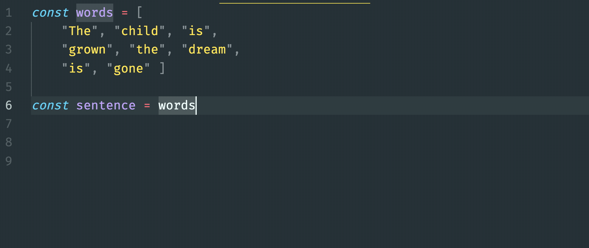

# The Map Array Method

> **Pro tip**: It is strongly recommended that you practice your learning efficiency when learning about <analogy>array</analogy> methods. They are a significant cognitive challenge for beginners who are transitioning from using `for..of` loops for everything. YouTube videos, W3Schools, GeekForGeeks, and ChatGPT should all be used as resources as you learn these methods.

Open the **`Metals`** <analogy>module</analogy> in VS Code. You will see that the list items for metals uses the `for..of` loop that you have seen in previous projects for building all of the HTML representations of data.


```js
export const MetalOptions = async () => {
    const response = await fetch("http://localhost:8088/metals")
    const metals = await response.json()

    let optionsHTML = "<h2>Metals</h2>"

    for (const metal of metals) {
        optionsHTML += `<div>
            <input type='radio' name='metal' value='${metal.id}' /> ${metal.metal}
        </div>`
    }

    return optionsHTML
}
```

Each <analogy>object</analogy> gets a corresponding `<div>` created for it. None are skipped. Each `<div>` is then appended to the singular <analogy>string</analogy> that will be returned from this <analogy>component</analogy> <analogy>function</analogy>.

You can accomplish this same feat with the `Array.map()` method.

* **<analogy>find</analogy>()** is for when you need to locate a single item in an <analogy>array</analogy>
* **<analogy>filter</analogy>()** is for when you need to locate _some_ of the items in an <analogy>array</analogy>
* **<analogy>map</analogy>()** is for when you to to _convert_ everything in an <analogy>array</analogy>

Here is how you would accomplish the same goal with **<analogy>map</analogy>()**.

```js
export const MetalOptions = async () => {
    const response = await fetch("http://localhost:8088/metals")
    const metals = await response.json()

    let optionsHTML = "<h2>Metals</h2>"

    // Use map() to generate new array of strings
    const divStringArray = metals.map(
        (metal) => {
          return `<div>
              <input type='radio' name='metal' value='${metal.id}' /> ${metal.metal}
          </div>`
        }
    )

    // This function needs to return a single string, not an array of strings
    const optionsHTML += divStringArray.join("")

    return optionsHTML
}
```

The `.map()` method also iterates the <analogy>array</analogy>, just like `for..of` does. Unlike a `for..of` loop, it invokes the <analogy>function</analogy> that you define.

Wait, what <analogy>function</analogy>?

This <analogy>function</analogy>. It returns a <analogy>string</analogy>, which gets added to the <analogy>array</analogy> that is getting built up during the <analogy>iteration</analogy>.

```js
(metal) => {
    return `<div>
        <input type='radio' name='metal' value='${metal.id}' /> ${metal.metal}
    </div>`
}
```

That <analogy>function</analogy> is the first, and only, <analogy>argument</analogy> that the `map()` method will accept. As it iterates the <analogy>array</analogy>, it will take the <analogy>object</analogy> at the current location and pass it as an <analogy>argument</analogy> to **your** <analogy>function</analogy>. Your <analogy>function</analogy> defines the `size` <analogy>parameter</analogy>.

So an _object_ comes into your <analogy>function</analogy>, and a _string_ gets returned. That <analogy>string</analogy> goes into a new _array_.

## The join() Array Method

The `.join()` <analogy>array</analogy> method, luckily, does exactly what its name infers - it _joins_ things together.

More specifically, it join **all** of the individual items in the <analogy>array</analogy> into a single <analogy>string</analogy>... all squished together.



If you join the strings in this <analogy>array</analogy>...

```js
[
   "<li> <input type="radio" name="size" value="1" /> 0.5 </li>",
   "<li> <input type="radio" name="size" value="2" /> 0.75 </li>",
   "<li> <input type="radio" name="size" value="3" /> 1 </li>",
   "<li> <input type="radio" name="size" value="4" /> 1.5 </li>",
   "<li> <input type="radio" name="size" value="5" /> 2 </li>"
]
```

...you end up with one long <analogy>string</analogy> filled with HTML.

```html
"<li> <input type="radio" name="size" value="1" /> 0.5 </li>
<li> <input type="radio" name="size" value="2" /> 0.75 </li>
<li> <input type="radio" name="size" value="3" /> 1 </li>
<li> <input type="radio" name="size" value="4" /> 1.5 </li>
<li> <input type="radio" name="size" value="5" /> 2 </li>"
```

## Generate Other Options

Now it's your turn.

Use the `map()` <analogy>array</analogy> method in the other <analogy>component</analogy> functions to convert the objects into HTML strings in a new <analogy>array</analogy>. Then use the `join()` method to squash the <analogy>array</analogy> of strings into a single <analogy>string</analogy> and <analogy>return</analogy> it.
