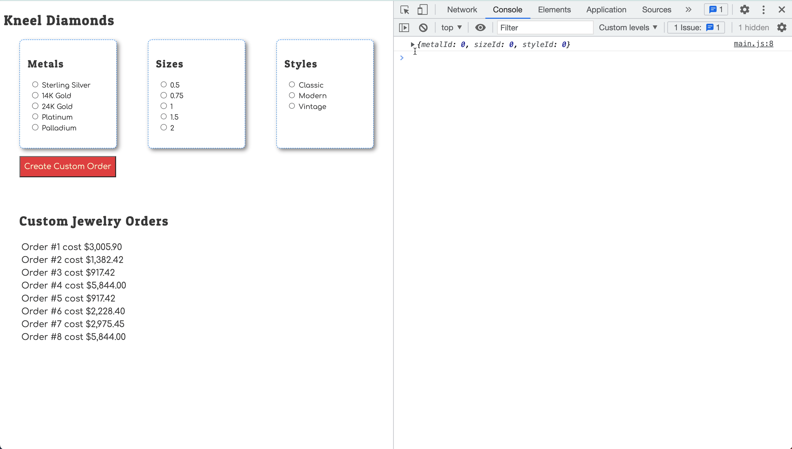

# Storing User Choices

## Learning Objectives

* You should be able to remember that <analogy>radio button</analogy> controls generate a _change_ <analogy>event</analogy> that you can listen for.
* You should be able to remember that when the user selects a radio input options, that the _value_ of the <analogy>event</analogy> target will be the <analogy>value</analogy> <analogy>attribute</analogy> of the chosen option.
* You should be able to implement an <analogy>event listener</analogy> for a group of radio input options.
* You should be able to implement a <analogy>module</analogy> that stores the user choices as they are made - the <analogy>transient state</analogy>.

## Transient State

Add a new <analogy>module</analogy> into your application that will store the <analogy>transient state</analogy> as the customers make their choices. Remember that initial <analogy>state</analogy> should be established to look exactly like how the data will be stored in your <analogy>API</analogy>, but with default values.

* <analogy>Boolean</analogy> values should default to `false`
* Integer values should defualt to `0`
* <analogy>String</analogy> values should default to an empty <analogy>string</analogy> `""`

Then write a <analogy>setter function</analogy> to <analogy>update</analogy> the <analogy>value</analogy> of each <analogy>property</analogy>. Make sure you <analogy>export</analogy> those functions for use in other modules.

## Change Listeners

Now, you need to listen for when the user makes a choice in one of the option groups. Start with metals.

```js
// The setMetalChoice() function used below is just an example.
// Change it to the name of the setter function you created.
import { setMetalChoice } from "./TransientState.js"

const handleMetalChoice = (event) => {
    // Make sure you change this condition if you named your inputs differently
    if (event.target.name === "metal") {
        setMetalChoice(parseInt(event.target.value))
    }
}
```

And in your <analogy>component</analogy> <analogy>function</analogy>, listen for the <analogy>change event</analogy> and specify the above <analogy>function</analogy> as the handler of that <analogy>event</analogy> being broadcast by the browser.

```js
 document.addEventListener("change", handleMetalChoice)
 ```

## Log the New State

If you want to make sure that <analogy>transient state</analogy> is changing correctly, use a `console.log()` inside the setter functions.


