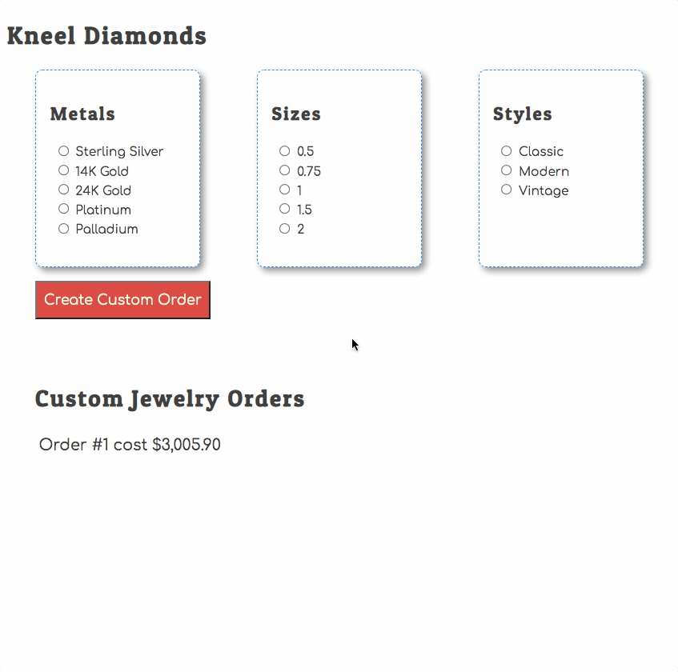

# Showing Prices on Jewelry Orders

You are currently showing a simple message for each jewelry order. Natasha wants to see the cost of each order in the list because if there are two orders that need to be done at the same time, she can focus on the one(s) that generate the most revenue first.

## Expanding the Response

<analogy>JSON</analogy> <analogy>Server</analogy> has a cool feature that you haven't seen yet. Up to this point, you have been making simple requests to get all objects in a collection...

```js
const ordersFetch = await fetch("http://localhost:8088/orders")
const orders = await ordersFetch.json()
```

Here is the data you get in the <analogy>response</analogy>.

```json
[
    {
        "id": 1,
        "metalId": 3,
        "sizeId": 2,
        "styleId": 3
    },
    {
        "metalId": 5,
        "sizeId": 2,
        "styleId": 1,
        "id": 2
    }
]
```

You also have the ability to tell <analogy>JSON</analogy> <analogy>Server</analogy> to expand the objects based on the foreign keys.

Open Postman and <analogy>request</analogy> orders again, but with the following URL. Note that there is a query <analogy>string</analogy> <analogy>parameter</analogy> at the end.

```txt
http://localhost:8088/orders?_expand=metal
```

Notice that each order now has a new <analogy>key</analogy> on it called metal, which is the corresponding metal for the order.

```json
[
    {
        "metalId": 3,
        "sizeId": 1,
        "styleId": 3,
        "id": 2,
        "metal": {
            "id": 3,
            "metal": "24K Gold",
            "price": 1258.9
        }
    },
    {
        "metalId": 5,
        "sizeId": 2,
        "styleId": 1,
        "id": 3,
        "metal": {
            "id": 5,
            "metal": "Palladium",
            "price": 1241
        }
    }
]
```

Next, expand the style by adding another query <analogy>string</analogy> <analogy>parameter</analogy>.

```txt
http://localhost:8088/orders?_expand=metal&_expand=style
```

There is now an expanded style <analogy>object</analogy> embedded in each order.
Lastly, expand the size by adding a third query <analogy>string</analogy> <analogy>parameter</analogy>. You will now see all of the related objects for the order embedded in the <analogy>response</analogy>.

```txt
http://localhost:8088/orders?_expand=metal&_expand=style&_expand=size
```

## Calculating and Using Total Price

Next, <analogy>update</analogy> your <analogy>component</analogy> <analogy>function</analogy> code to fetch the orders with all foreign keys expanded to their full, related objects. Each order <analogy>object</analogy> will now have the prices of the chosen metal, size and style that the user made.

<analogy>Update</analogy> your <analogy>iteration</analogy> code to add up the price of the metal, style, and size.

```js
const orderPrice = order.metal.price + order.style.price + order.size.price
```

Once that is calculated, interpolate that total in the HTML <analogy>string</analogy> that you currently are generating. Here is an example.

```js
`<div>Order #${order.id} cost ${orderPrice}</div>`
```

When you're done, the correct price will appear for each placed order.


