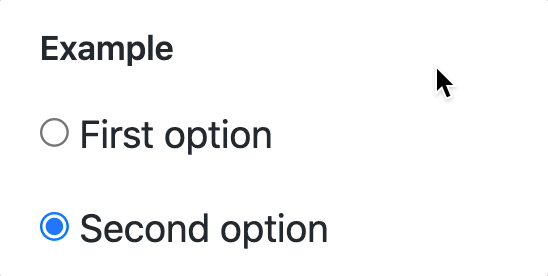
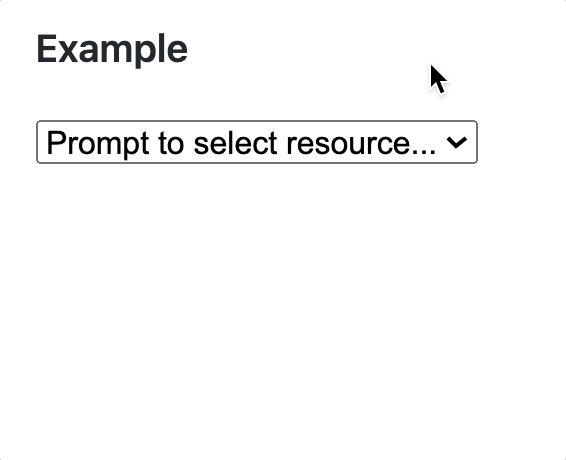

# Display Your Options

To display a group of options, the two most common controls used by designers and developers are:

1. The <analogy>radio button</analogy>, which displayed each option an an individual item to be clicked on with a filled-in circle indicating the selected option.
    ```html
    <input type="radio" value="1" name="resource"> First option
    <input type="radio" value="2" name="resource" checked> Second option
    ```

    

1. The <analogy>dropdown</analogy> menu using the `<select>` <analogy>HTML element</analogy>. Whichever option the user chooses will then be displayed in the <analogy>select</analogy> box.
    ```html
    <select id="resource">
        <option value="0">Prompt to select resource...</option>
        <option value="1">First option</option>
        <option value="2">Second option</option>
    </select>
    ```

    

## Getting the Selected Option

To get the option that the user selected, you would access the `.value` <analogy>property</analogy> of the `<select>` <analogy>element</analogy>, not the individual options.

```js
const changeHandler = (changeEvent) => {
   if (changeEvent.target.id === "resource") {
      const chosenOption = changeEvent.target.value
      console.log(parseInt(chosenOption))
   }
}
```

| | |
|:---:|:---|
| <h1>&#x270e;</h1> |  _Note that you can <analogy>assign</analogy> a unique `id` <analogy>attribute</analogy> to a `<select>` <analogy>element</analogy>, whereas you need to use the `name` <analogy>attribute</analogy> when using radio buttons._ |

