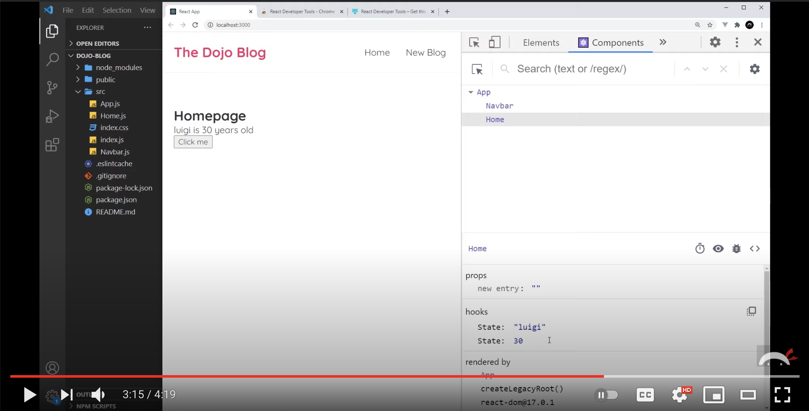

# Getting Started with React

React is a library that was open sourced by the development team at Facebook with the sole purpose of managing how data is displayed to the user. It doesn't care about the database, it doesn't care how data is retrieved, and it doesn't care about how complex the rest of the application is.

You've already learned the vast majority of what React does for you when building the UI for your application.

1. Building components and child components
1. Modular code with JavaScript modules
1. Updating the DOM with document elements or string templates
1. Setting the state of a component

## Creating the Application

Run the following commands _one at a time_ to do the basic software package installations

```sh
cd ~/workspace
npm create vite@latest honey-rae-repairs -- --template react
cd honey-rae-repairs
npm install
```
## Project Setup

We are giving you some boilerplate (starter) code that you will then customize as you build out the Honey Rae Repairs application with React. Run the following command in your terminal.

<!-- TODO: Change this link to cohort 66 branch -->

```sh
/bin/bash -c "$(curl -fsSL https://raw.githubusercontent.com/nashville-software-school/course-bash-scripts/main/client/repair-setup.sh)"
```
## Installing React Developer Tools

You can install the React Developer Tools via the <a href="https://chrome.google.com/webstore/detail/react-developer-tools/fmkadmapgofadopljbjfkapdkoienihi" target="_blank" rel="noopener noreferrer">Chrome Store</a>.
You will get two new tabs in your Chrome DevTools:

* ⚛️ Components
* ⚛️ Profiler

These tools will help you debug and inspect your React applications.

## React Developer Tools

Watch the Intro to React Dev Tools video below to review their usage. Again, just like with VanillaJS, your use of the React dev tools is the only other way than using the debugger to gather evidence.

<a href="https://www.youtube.com/watch?v=rb1GWqCJid4" target="_blank" rel="noopener noreferrer"></a>

<details>
<summary>📄 Video Transcript — React Dev Tools</summary>

[0:03] alright and gang so before we go any further i just wanted to take a quick side step and let you know about an extension for chrome and firefox called react developer tools and you can find it for chrome on the chrome store right here just click on the install button mine says remove because it's already installed and you can also get it for firefox by going to the firefox add-ons library and installing it right here so i'll leave the link to both of these pages down below so you can install whichever one you need so what react developer tools do for us is integrate with the browser development tools and give us extra features that we can use on any website created with react so if we take a look over here we can see two extra tabs we have components and profiler now the one i use the most is components

[0:49] right here and this basically gives us a component diagram or component tree of our current application so if we're just taking nosy at these things if we hover over one of these different components we get some extra information about that component down below so this first one right here this is to do with props now we're not covered props yet so this isn't going to make much sense at the minute so we'll move on for now and down here we can see the source file we also get some tabs over on the right as well or rather icons now if we click on this one this is to do with suspense which is kind of beyond the scope of this tutorial this one right here we can click on this to find whatever dom element this represents in the elements tab so if i click on this then it grabs us this div with the class

[1:36] of app and remember that is the root element inside the app component right here so it finds us that element now if i did that for a different component for example to navbar if i click on this it grabs us the nav bar okay okay so this one right here this logs all of the data about the components to the console so if i was to click on this then go to the console we can see all of this information about the app component including any props the dom nodes the location of the file etc so let's go back to components and then finally this thing right here we can view the source file so the javascript file of this component in the dev tools as well okay

[2:23] so if we click on the home component this is going to be a bit more interesting because we have data inside the home component remember we have this thing right here we have these two pieces of state and they change when we click on this button so if i now come down here we can see this property called hooks and we have a state hook remember this is a hook use state so it says we have a state for luigi and one for this value 30. now if i was to click on this button well let's refresh first because they're not the initial values i'm going to refresh and then click on home we can see now this is the state mario and 25 if i click on this we can see hopefully the state change down here as well so

[3:10] this tracks whatever the state of this component is so if we want to find that out quickly we can do by going to this components tab and looking at the hooks and the state okay so what about if we click on this thing right here log this component to the console so if we click on that and then go to the console and expand this information now we can see this property as well hooks and this is an array of data each one an object and each object represents the piece of state that we have so we have right here the value luigi and each one has an id as well and it says whether the state is editable which it is we can change it if we want to awesome so that's some extra information that we have about each component so that's just a brief introduction to

[3:57] react dev tools i did want to let you know about this tool which can be really helpful when you're developing testing or debugging your react applications now the best way to become familiar with this is to just dive in and play around with it and maybe we'll be jumping in from time to time too especially when we learn about props so we can see this value right here

</details>


## Starting Your React Application

In your terminal, make sure you are in the top-level project directory, and not in the `public` or `src` sub-directory, and type the following command.

```sh
npm run dev
```

The process of building your React application will begin and the following things will happen.

1. You will see the following message in your terminal.
    ```sh
      ➜  Local:   http://localhost:5173/
      ➜  Network: use --host to expose
      ➜  press h + enter to show help
    ```
1. Navigate to http://localhost:5173/ in your browser
2. In your browser the app should be running with no errors and you should see this welcome page:
   

If these three things do not happen, call on a mentor. Otherwise, move on to the next chapter.

## Backup to Github

Make sure you create a repository on your Github account for your app, and hook up the `honey-rae-repairs` directory. As you work through these chapters, regularly push up to Github.
