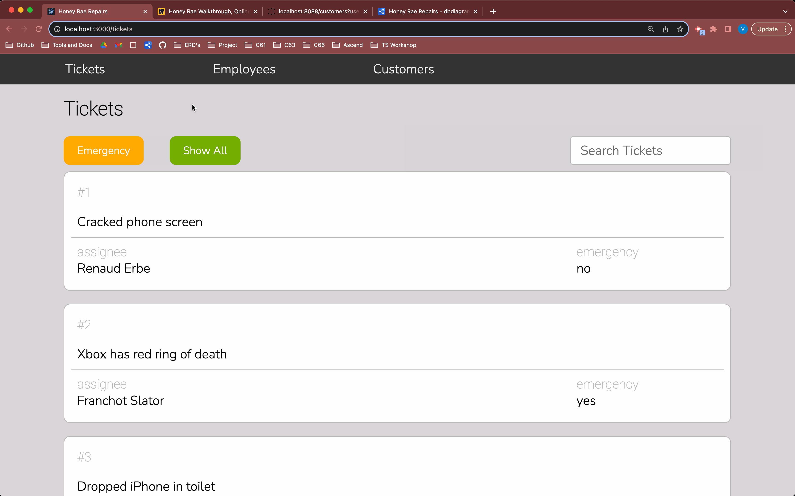

# Introducing Routes In Your Application
In order to include routing functionality in our application, we need to install a third-party library called _React-Router-Dom_.

In the root of your application run the following command:
```shell
npm install --save react-router-dom
```

## 📺 Watch The Video

### ⚠️ Note on the video: 
This video instructs you to make the files `components/nav/NavBar.js` and `components/users/User.js`. Make sure your files end in `.jsx` instead of `.js`.

Watch the <a href="https://youtu.be/IIb47gZBFbY?si=_ZhOwvEDdOQL_3y1" target="_blank" rel="noopener noreferrer">Intro to Routes</a> video and implement the code yourself. Then read the rest of the chapter summarizing what you've learned.

<details>
<summary>📄 Video Transcript — Intro to Routes</summary>

[0:03] welcome to part three of Honey Ray repairs where we introduced routing now where we left off we had a few different components or larger components that we built one for the customer list one for the employee list and then also for the ticket list in our ticket list we're also rendering a ticket filter bar and for each ticket we're going to render a ticket component so this is all the components that we currently have now to test out these components we just rendered them here in app.js one by one to see if they were working properly well now we want to introduce routes and depending on where the user is in our in their application we will see a different route all right so to get that set up the

[0:49] first thing we need to do is after installing react router Dom we need to wrap our app component with browser router so browser router is an is a component that we get from react router Dom so we need to import that all right so now I'm going to wrap the app component with browser router now what browser router does is it keeps our application in sync with the URL we need this because we want to render different components depending on which URL the user visits

[1:35] so now back in our app.js component we're going to Define some routes and we want to Define routes we need to wrap all of our routes in a routes component which is another component that we get from react router Dom so we're going to wrap all of our routes in a route component this says hey we're going to Define some routes here now we do need to import that so routes oops there we go and now I can start defining some a route for each one of these here let's start with a route for our tickets so I'm going to get rid of all this here and I'm going to define a new route

[2:21] so I want to use the route component and what I want to do is Define the path for this route so it says this basically says to the route hey when the URL is at this path so when it's at forward slash tickets we want to render this component so that's we're going to use the element and we say we want to render the ticket list component and we can make a route a self-closing tag all right now we just need to import route from react router Dom and there we have it okay so if we want to Define routes we need

[3:07] to wrap all of the routes that we're going to Define in a routes element and then each route will have a path so that is saying when the URL is at this path it will also have an element we say this is the component we want to render when the URL is at forward slash tickets okay so let's try this out so in my browser currently I am at home so if I go forward slash tickets I now see my tickets component great now instead of having to type in the URL here in order to get to that component I'd like to have a nav bar so when I click

[3:54] on tickets just like we have here tickets it will take me to the tickets component it'll take me to that ticket URL or the slash tickets URL so I want a navbar when I click tickets I want it to make my URL forward slash tickets and we've already set up the route to render the tickets list component when we are at that URL so I'm going to do is in my components directory I'm going to make a new directory called nav where I'm going to handle all of my navbar functionality so I'm going to create a nav bar component

[4:40] and I'm also going to create a navbar.css for my styles I'm going to copy and paste my Styles here and I'm not going to forget to import it this time so import nav bar.css now let's make our navbar component so great nav bar and what I'm going to have this do is return just an unordered list so I'm going to have all of my nav links be in an unordered list

[5:26] all right I'm going to give this a class name of navbar and then each link here is going to be a list item so I'm going to have list item give it a class name of nav bar item and now here is where the real real work begins so another component that we get from react water router I can't say that another link that another component that we get from react router Dom is the link component now what the link component does is it allows the user to navigate to another page by clicking on it so basically with the link component will do is we say hey navigate to this URL so

[6:14] 2 forward slash tickets that's where we want whenever we click on this link we wanted to make the URL forward slash tickets all right and I want it to be tickets that's what I want to display on the navbar but I do need to import this from react router Dom so link there we go okay cool so when the user clicks on tickets it will take them to forward slash tickets and in our app we have a route set up to listen for forward slash tickets so when the URL is at forward slash tickets it will render the ticket list component

[6:59] but we don't have anything telling us when to render a nav bar so we do want our navbar to persist throughout the whole application so what I'm going to do is I'm going to create a route for the home and I'm going to give it the element of the nav bar nav bar so back in our browser there's we are uh here we are at the home route now we have our nav bar here so if we click on tickets it's going to take us

[7:45] to forward slash tickets and now we're rendering our ticket list awesome all right so let's fix this nav bar we want it to persist with every view of our application not just when we're at forward slash home we wanted to have it whenever we're at forward slash tickets or forward slash customers we want it for every view of the application here so what I'm going to do is I'm actually going to make the Home Path a parent route so we're going to make another route here for the closing tag oops that didn't quite work there we go so I'm opening up this route and I'm going to make all the other routes child routes of

[8:31] the Home Route and now we can get rid of this forward slash here for tickets since it is a child of the home so now what this means is that whenever we are at forward slash tickets we will render our ticket list component but no matter where we are we will always render our nav bar since that is the element for the home okay let's see if this works so let's go to the browser and if I click on tickets well it did take me to forward slash tickets but I'm not seeing my tickets anymore

[9:19] this is because we need to tell the parent route where in relation to the parent routes element to render the child route element now we do this by using the outlet component that we also get from react router Dom so I'm going to create a react react fragment here pass in my nav bar so basically I'm going to use the outlet component and what this means is that it says whenever we are at whenever we match one of these routes below for the child route

[10:04] we will render that element right here now if we don't have it it's not going to render the element at all so let's see if that's working here here we are at home there's a nav bar so if I click on tickets it takes us to forward slash tickets and here's a ticketless component now just so you can understand a little bit better how Outlet works let's move the outlet here above navbar so that means that whenever we find a child route that matches it's going to render the child element above the nav bar

[10:49] all right and now we can see that we're at forward slash tickets and then there's our nav bar at the bottom so this will work if we wanted to have like a header and a footer that persisted throughout the whole application I would rather our navbar B up at the top though all right now let's get customers set up so let's add a new link to our navbar for customers the class name of nav bar item

[11:41] all right so let's take a look at the browser now if we go to if we click on customers that will take us to forward slash customers now we just need to set up our route to say when we're at forward slash customers render that customer list component so I gotta go here to app.js I need a new route the path is going to be for forward slash we're making a child of that so customers element that I want to render will be the customer list component

[12:27] okay let's see if it works so here we are at home we click on tickets here's our ticket list component still works we click on customers it takes us to forward slash customers and here's our customer list component and that's the basics of routing

</details>

### 🔸🔻🔹 CSS for this chapter
<details>
  <summary>NavBar.css</summary>

  ```css
    .navbar {
      display: flex;
      flex-wrap: nowrap;
      background-color: var(--dark);
      margin: 0;
      width: 100%;
      padding: 0.5rem;
    }

    .navbar-item {
      flex-basis: 20%;
      list-style-type: none;
      text-align: center;
      color: var(--offWhite);
    }

    .navbar-link {
      text-decoration: none;
      font-family: "Quicksand", sans-serif;
      letter-spacing: 1px;
    }

    .navbar-logout {
      margin-left: auto;
    }

    .navbar-link:hover {
      color: var(--primary);
    }
  ```
</details>

## Setting Up Routes
In the video you learned how to set up routes for your application. 

We started off by wrapping our entire application with the `<BrowserRouter>` <analogy>component</analogy>. This keeps our application in sync with the URL, which we need because we want to render different <analogy>components</analogy> depending on which url the user visits.

Then we defined some <analogy>routes</analogy> using the `<Route>` <analogy>component</analogy>.

A `<Route>` <analogy>component</analogy> tells our application, "Hey, when the url is _here_, I want you to render _this_." Let's see that in action.

```jsx
<Route 
  path="/welcome" 
  element={
    <div>
      <h1>Hello World!</h1>
    </div>
  }
/>
```

In the example above, we defined a Route so that when the URL for the application is at _/welcome_ a `div` with an `h1` that displays "Hello World!" will render to the page.


Similar to creating an unordered list in html where all of your `<li>` elements must be wrapped with a `<ul>` element, all of the `<Route>`'s you wish to define must be wrapped with a `<Routes>` component.

```jsx
<Routes>
  <Route path="/about" element={<AboutUs />} />
  <Route path="/contact" element={<ContactUs />}/>
</Routes>
```

## Child <analogy>Routes</analogy>
We also learned how to nest routes: 

```jsx
<Routes>
  <Route path="/">
    <Route path="about" element={<AboutUs />} />
    <Route path="contact" element={<ContactUs />}/>
  </Route>
</Routes>
```

Here, if the user navigates to _/about_, the `<AboutUs />` component will render. Nesting routes also makes it possible for us to dynamically "stack" our components based on the url of the application. Let's say we wanted a header and a footer for our app to persist through the views of our application. We could add the header and footer to the element of our `/` Route.

```jsx
<Routes>
  <Route 
    path="/"
    element={
      <>
        <Header />
        <Outlet /> {/*This is where the child route element will render*/}
        <Footer />
      </>
    }
  >
    <Route path="about" element={<AboutUs />} />
    <Route path="contact" element={<ContactUs />}/>
  </Route>
</Routes>
```
 We then added an `<Outlet />` <analogy>component</analogy> to tell the parent <analogy>route</analogy> where to render the child <analogy>route</analogy> element. Now when the user visits _/about_, they will see:

 ```jsx
<Header />
<AboutUs />
<Footer />
 ```

If you forget to add the `<Outlet />`, however, your child <analogy>route</analogy> elements will not render.

## Creating a <analogy>Link</analogy>
A `<Link>` is an element that lets the user navigate to another page by clicking or tapping on it. A `<analogy>Link</analogy>` tells our application, "Hey, go _to_ this URL."

```jsx
<Link to="/about">About</Link>
```

When the user clicks on that link, the url will change to _/about_. And then what will happen? Well, if you're looking at those routes we defined above, the `<AboutUs />` component will render! 

# 💪 Exercise Time!
Now that you're an expert, write the routing functionality for the Employees List. When the user clicks on _Employees_ in the navbar, the user should be directed to _/employees_ and the employee list should render.  



**Copy and pasting is _boring_**

## 📓 Vocabulary 
> **<analogy>Route</analogy>:** A <analogy>component</analogy> from the react-router-dom library that allows us to define which <analogy>components</analogy> or <analogy>jsx</analogy> should render on the page depending on the url of our application.

> **<analogy>Routes</analogy>:**  A <analogy>component</analogy> from the react-router-dom library that is used to define our list of <analogy>routes</analogy>. All `Route` <analogy>components</analogy> defined in an application must be wrapped with the `Routes` <analogy>component</analogy>.

> **<analogy>Outlet</analogy>:** A <analogy>component</analogy> from the react-router-dom library that defines where a child <analogy>Route</analogy> element should render in relation to it's parent <analogy>Route</analogy> element. If a parent <analogy>Route</analogy> has an element, the `<Outlet />` <analogy>component</analogy> must be rendered within it or the child elements will not display.

> **<analogy>Link</analogy>:** A <analogy>component</analogy> from the react-router-dom library that navigates to the url defined in the `to` <analogy>prop</analogy> passed to the <analogy>component</analogy>.

### _Disclaimer_
React-Router-Dom is a very powerful tool and it's constantly evolving. In this course, you will learn the basics of routing with React-Router-Dom, enough to build a solid application, but this is only the tip of the iceberg and it does not include the latest features. If at any point you are feeling curious and would like to learn more about React-Router-Dom and what it can do, visit the <a href="https://reactrouter.com/en/main" target="_blank" rel="noopener noreferrer">docs</a>. We will continue to cover more features of React Router Dom as you make your way through this project.
