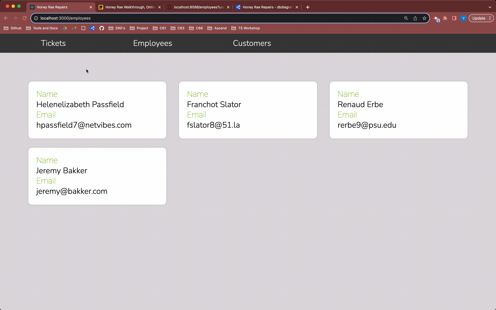

# Customer Details View

## 📺 Watch The Videos

### ⚠️ Note on the video: 
This video instructs you to make the file `components/customers/CustomerDetails.js`. Make sure your file ends in `.jsx` instead of `.js`.

First, watch the introduction to the **useParams hook** video and implement the code yourself. Next, watch the **Customer Details** video and implement the code yourself. Then read the rest of the chapter summarizing what you've learned.

<iframe name="yt-ex11a" src="https://www.youtube.com/embed/fPfQ4JjPQps" width="700" height="394" frameborder="0" allow="accelerometer; autoplay; clipboard-write; encrypted-media; gyroscope; picture-in-picture" allowfullscreen></iframe>

<details>
<summary>📄 Video Transcript — useParams Hook</summary>

<a href="https://www.youtube.com/embed/fPfQ4JjPQps?start=2&autoplay=1" target="yt-ex11a">[0:02]</a> all right at this point we have routes set up for our tickets our employees and our customers however when we're at the home of our application so like maybe you want to user logs in or when they enter this web application we're greeted with nothing at the moment until we choose a link so we want to render something when we're at the root of our application now in our wireframe we see here that when we're at home we want to see this welcome to Honey Ray repair shop little display here so let's go ahead and make that component all right I'm going to add a new folder to my components here we're just going

<a href="https://www.youtube.com/embed/fPfQ4JjPQps?start=47&autoplay=1" target="yt-ex11a">[0:47]</a> to call this welcome and I'm going to make that welcome component so we're going to make welcome.js I'm also going to have some styles for this so I'm going to have a welcome.css and I'll go ahead and copy and paste my styles in here there we go now let's make the component so I'm going to want to make sure I remember to import my styles so we want welcome.css and let's go ahead and make this component so export const welcome

<a href="https://www.youtube.com/embed/fPfQ4JjPQps?start=97&autoplay=1" target="yt-ex11a">[1:37]</a> and we're just going to have this return oops can't spell um we always want this to be a div I'm gonna give it a class name of welcome container and in here I'm going to have an H1 and we'll put inside of this H1 a span it says welcome to and after that it's going to say honey oops Ray repair shop okay and I'm gonna have that also be in its own little span as well

<a href="https://www.youtube.com/embed/fPfQ4JjPQps?start=149&autoplay=1" target="yt-ex11a">[2:29]</a> all right got the closing one here on accident there we go all right and then I want another div that says your one oops Stop Shop to get all your electronics all right so when the user is at the home route we want to see this welcome component so I guess what do we want to do we're just going to put it here let's see what happens welcome all right looks like it imported it for me so let's take a look

<a href="https://www.youtube.com/embed/fPfQ4JjPQps?start=200&autoplay=1" target="yt-ex11a">[3:20]</a> all right give it a refresh hmm oh I don't think I saved all right cool so now we're seeing our welcome to Honey Ray repair shop let's see what happens if we go to tickets all right well I'm now getting welcome to Honey Ray repair shop looks like for every single route don't really want that I just want it to display when we're at the home but not when we're at one of the other or routes here so if we want to do that we can use the index route so I'm going to add an index for out here as a child route of the Home Route

<a href="https://www.youtube.com/embed/fPfQ4JjPQps?start=245&autoplay=1" target="yt-ex11a">[4:05]</a> so I'm going to make a new route and instead of having a path this one's going to say index so this is like the default route for the parent route or the like the default child route so basically the way the index route works is that it will render into the parent Outlet if it has one um at the parents URL so whenever we're at home we're going to render the index route right here all right so the element we want to render will be the welcome there we go component all right let's see if that fixes our problem go to the browser let me get this a refresh oh I forgot to remove the welcome from

<a href="https://www.youtube.com/embed/fPfQ4JjPQps?start=293&autoplay=1" target="yt-ex11a">[4:53]</a> this one there we go all right now let's take a look Okay cool so now we're not seeing that anymore we go to customers I can go to employees I can go to tickets it's not there but it is now the index route for the home route so if we're at forward slash we're gonna see it right here it's going to render right in the outlet just like the rest of them okay now let's begin implementing the see here we want to go to customers let's implement the customer details view so when we click on a customer we want to navigate to the customer details view where we will see this

<a href="https://www.youtube.com/embed/fPfQ4JjPQps?start=340&autoplay=1" target="yt-ex11a">[5:40]</a> component displaying the name address email and phone number of a customer so the first thing I'm going to do here in the code is I'm going to ratch I'm going to wrap each one of my customers I'm going to go to my customer list component and I'm going to wrap each one of these user components with a link now currently we're using link in the navbar component here right so if the user clicks on customers right if they click on customers it's going to take us to forward slash customers I can put anything I really want in here so I want to wrap that user component that we're rendering in customer list with a link that way when they click on this it'll take them to well let's see where do we

<a href="https://www.youtube.com/embed/fPfQ4JjPQps?start=386&autoplay=1" target="yt-ex11a">[6:26]</a> want it to take them let me go ahead and add my component here and let's put that at the end there we go and we need to import it so that comes from react router Dom so import our link there we go from react react router Dom never going to get that right on the first try all right so where do we want this to take us well I wanted to take us to customers forward slash and I'm going to pass the customer ID so that's what I want my route to be so we're going to go to and now since I'm going to be using some string interpolation I'm going to open up some curly braces since

<a href="https://www.youtube.com/embed/fPfQ4JjPQps?start=432&autoplay=1" target="yt-ex11a">[7:12]</a> using string interpolation is a JavaScript functionality so I want it to take us to forward slash customers or not customer customers slash and now I'm going to put the customer ID here so it's actually going to be the user ID so remember we're we're getting those users getting the non-staff users from our database all right so that's going to take us to that ID so let's see if that works and you know what I'm actually I'm actually going to add some additional styling to my user component that way it kind of gives it a little bit of a hover that indicates that you can click on this so let me go to my user CSS

<a href="https://www.youtube.com/embed/fPfQ4JjPQps?start=478&autoplay=1" target="yt-ex11a">[7:58]</a> and I'm going to add this hover here kind of makes this look clickable all right let's go to the browser okay so when I'm at my customers that's cool now they look clickable so if I click on one all right that takes me to customers forward slash one now I'm at customers forward slash two and customers forward slash three so whenever we click on one that ID for this user is going to be there in the URL now we're going to be able to use that we're gonna be able to capture that ID and then we're going to use that to then end up displaying the details for that user and the customer of that user here on the page

<a href="https://www.youtube.com/embed/fPfQ4JjPQps?start=523&autoplay=1" target="yt-ex11a">[8:43]</a> all right so let's get started with the route okay so this is going to be a route for forward slash customers slash and then the customer ID so I'm actually going to make customers a parent route here so I'm going to open this up there we go route and I'm going to create a new route for that customer details but I don't want the customer list to display with it right because if we have this element here stupid hover if we have this element here then that means and I'm talking about this one here on this parent route we have this element here on this parent route that means that this customer list is going to

<a href="https://www.youtube.com/embed/fPfQ4JjPQps?start=569&autoplay=1" target="yt-ex11a">[9:29]</a> render for each child element that gets rendered for the URL that matches so I really don't want that to happen I don't really want anything to render for each child component so I'm going to take this off here and I'm going to make another index route all right so let's make an index route so when we're at forward slash customers we want to render the customer list element and now we're going to set up our route for our forward slash customers slash ID right so we're gonna have a route and this time the path is going to be

<a href="https://www.youtube.com/embed/fPfQ4JjPQps?start=614&autoplay=1" target="yt-ex11a">[10:14]</a> so whenever we're at slash customers slash and I'm just going to use this colon here to get the customer ID so what this is right here this is called a route parameter right so I'm going to be able to capture that ID here and store it in this customer ID what this is actually going to end up being is a key value pair so customer ID is the key and the value is going to be whatever ID is rendering at that position at slash customer slash and then we're storing whatever comes after that right here in customer ID all right so I'm going to render an element and for now we're just going to we're just going to say you know

<a href="https://www.youtube.com/embed/fPfQ4JjPQps?start=661&autoplay=1" target="yt-ex11a">[11:01]</a> customer ID or customer details yeah let's do that that way we can see if this is working now we're not capturing this yet but we are storing it all right so let's just see if this gets rendered when we're at one of those routes okay so see how my customer slash three so we are just we are hitting that route and we are rendering that element so now we just need to go ahead and get a component set up so that we can capture this ID that we're storing in a key called customer ID then we'll be able to some other employees here we go and there's three then we'll be able to use that ID to get our customer from the database

<a href="https://www.youtube.com/embed/fPfQ4JjPQps?start=709&autoplay=1" target="yt-ex11a">[11:49]</a> okay so I'm going to add a new component under my customers directory here oops that's not what I want to do here we go we're going to call this customer details it's going to be a new component customer details all right and so we're going to use something here in order to capture that URL so I'm just going to kind of show here we'll say we're at customers customer slash three right so let's say that's our route or the path in our in our application all right remember we set up a route for the path to be

<a href="https://www.youtube.com/embed/fPfQ4JjPQps?start=754&autoplay=1" target="yt-ex11a">[12:34]</a> whenever we are at forward slash customer slash customer ID this is going to be the key and this right here is going to be the value I think this is actually customers there we go all right so in the way that we can get this key value pair is with the use params hook that we get from react router Dom so the use params Hook is going to return to us an object with that key value pair so use params and it's not Auto importing it for me probably because I'm kind of being weird here but I just wanted to show you that this is going to return to us customer ID

<a href="https://www.youtube.com/embed/fPfQ4JjPQps?start=801&autoplay=1" target="yt-ex11a">[13:21]</a> as the key and then the value let's just say in this case we clicked on three so it's going to be three so I'm going to destructure that customer ID is the key is equal to use params so import just need to import that hook from react router Dom oh I said it right the first time use params there we go all right so just to show you I'm going to just return of that customer ID so it's going to say customer number and we'll just say customer ID

<a href="https://www.youtube.com/embed/fPfQ4JjPQps?start=849&autoplay=1" target="yt-ex11a">[14:09]</a> alrighty let's head back to the browser let's go back to my customers here oh it's not going to work you know why because we didn't tell that route to render this component so let's head back to app.js now instead of just rendering this garbage let's render the customer details component there we go Kyle's head of the browser all right so here's my customer list so if I click on customer number one there is number one in my path here and now I can see customer number one if I click on customer number two there it is we are getting access to

<a href="https://www.youtube.com/embed/fPfQ4JjPQps?start=894&autoplay=1" target="yt-ex11a">[14:54]</a> this via use params and displaying it right here and for number three there we have it so let's go over how that works one more time alrighty so we have a path here that says whenever we are at and I can't quite maybe I can do it this way yeah let's try this trying to make a comment here so this path is for whenever we are at slash customers slash and then some ID so customer ID so whenever the path of our of our application matches this it's going to take whatever is after customers and store it on an object where the key is

<a href="https://www.youtube.com/embed/fPfQ4JjPQps?start=940&autoplay=1" target="yt-ex11a">[15:40]</a> customer ID and the value is going to be whatever is at that at that position in the URL and then we're going to render this customer details component so in the customer details component I can get access to this value right here with the use params hook use pram's Hook is going to return to meet an object with a key value pair the key being whatever I defined right here on the route where's my app.js there you are the key is what we defined right here so if I name something else like just ID for instance then here in customer details if I wanted to use use params the key would be ID

<a href="https://www.youtube.com/embed/fPfQ4JjPQps?start=986&autoplay=1" target="yt-ex11a">[16:26]</a> all right and then that would mean that the key value pair is ID and if we were at forward slash customers slash three then the value is going to be 3. for yours if our URL is forward slash customers slash two then the value would be two all right so what matters here is what we name our path so this little colon is how we're setting up that that key so we want to name it customer ID then when we're using use params in order to get that here we go we have to Define it the same here so we're expecting a object with a key value pair of customer ID

<a href="https://www.youtube.com/embed/fPfQ4JjPQps?start=1038&autoplay=1" target="yt-ex11a">[17:18]</a> oops there we go helps if I can type all right so now we have access to that customer ID from the URL and now we're just rendering this div with customer ID awesome and that's how I use params works all right the next video in this chapter is going to be displaying the customer details

</details>

<iframe name="yt-ex11b" src="https://www.youtube.com/embed/aiVEFIHDj4k" width="700" height="394" frameborder="0" allow="accelerometer; autoplay; clipboard-write; encrypted-media; gyroscope; picture-in-picture" allowfullscreen></iframe>

<details>
<summary>📄 Video Transcript — Customer Details</summary>

<a href="https://www.youtube.com/embed/aiVEFIHDj4k?start=3&autoplay=1" target="yt-ex11b">[0:03]</a> all right now that we have a component for our customer details and we are getting the customer ID from the URL via use params let's go ahead and create this component to get our customer details now if you want to go ahead and take a shot at doing this on your own feel free to do that and you can try coming back to this video if you get stuck but for now we're going to walk through every step of doing this so once again if you want to try this on your own I highly encourage that just pause the video here and you can resume when you get stuck and you want to see what you've done or how to move forward or you get you get what I'm saying okay so we want to start displaying the details for this customer

<a href="https://www.youtube.com/embed/aiVEFIHDj4k?start=49&autoplay=1" target="yt-ex11b">[0:49]</a> let's take a look at our wireframe here now we want to display the name the email the address and the phone number of a customer if we look at our Json server the name and the email appear here on the user right we've got full name we got email but the rest of the details that we want are going to be on the customer object address and phone number now the user ID there is a foreign key on the customer object and we are getting access to that user ID right here via use params because when we click on a customer it's navigating to the URL customers forward

<a href="https://www.youtube.com/embed/aiVEFIHDj4k?start=96&autoplay=1" target="yt-ex11b">[1:36]</a> slash and that ID just for a quick refresher on how we did that in our customer list when we when the user clicks on a user when the that's kind of a weird thing to say when the application user clicks on this component that we've wrapped with this link here it will navigate to customers slash and then the ID of that customer that they clicked on now just to clarify here that this ID is the user ID okie dokie so back in customer details we want to get all the information for this customer and we currently have this user ID here for the customer I'm understanding now that it's a little

<a href="https://www.youtube.com/embed/aiVEFIHDj4k?start=143&autoplay=1" target="yt-ex11b">[2:23]</a> confusing because I would I would guess I would call this customer ID and this would be user ID but we're just gonna roll with it okay so what we're going to do is we're going to set up let's say we ended up at customer slash two so we want the customer where I'm going to start a query here where the user ID is equal to say two right so that's going to get us this customer right here now we pay uh pay close attention here what we're actually getting back is an array so it's going to give us all the customers where user ideas do now we know that only one is going to exist well ideally if we don't have bad data only one would exist for customer ID is too since

<a href="https://www.youtube.com/embed/aiVEFIHDj4k?start=191&autoplay=1" target="yt-ex11b">[3:11]</a> not customer ID user ID sorry about that um we're user IDs too since this is the primary ID for a user but yes this is coming back from coming back as an array so we want to keep that in mind okie dokie well we want the customer where user ID is equal to two and we also want to get the information from the user object we want that full name and email so I'm going to use the expand query so and expand and underscore expand equals we're going to expand on that user object there we go so let's see here we are getting address we are getting phone number full name and email which is everything

<a href="https://www.youtube.com/embed/aiVEFIHDj4k?start=238&autoplay=1" target="yt-ex11b">[3:58]</a> we wanted here all right I'm going to go ahead and slap this in my code here so now I'm going to want a new function to get a user by or get a customer by its user ID so let's hear do we have a customer service let's look at our services folder we don't so let's go ahead and set up a customer service when I'm a customer service and in this customer service I'm going to want a new function so export const I'm going to call this get customer buy user ID that's a great function name because it tells me exactly what this function does

<a href="https://www.youtube.com/embed/aiVEFIHDj4k?start=286&autoplay=1" target="yt-ex11b">[4:46]</a> all right so if we are going to get a customer buy the user ID well we're gonna need the user ID right all right now I'm going to return a vegetable I'm going to go ahead and paste that in there but instead of this always getting user ID too I want to pass in my user ID there we go then response dot Json Perfect all right now back to my customer details well I'm going to want to import that I'm going to see if it'll do it for me so on the initial render of this customer details component I want to go ahead and fetch that customer

<a href="https://www.youtube.com/embed/aiVEFIHDj4k?start=332&autoplay=1" target="yt-ex11b">[5:32]</a> so I've got the customer ID I just want to get it so I'm actually going to need some state right I want to store my customer in a state variable so I'm going to go ahead and go ahead and declare that all right so this is going to be our customer and set customer and we're going to give this an initial value of an empty object know why it hates I don't know why it hates me there we go never wants to Auto Import that for me it'll do the use effect but it won't do the use state okay now I'm going to be setting my customer here right with the customer that I get back from the database

<a href="https://www.youtube.com/embed/aiVEFIHDj4k?start=378&autoplay=1" target="yt-ex11b">[6:18]</a> so I'm going to need to wrap this in a use effect because I can't set my customer here on the component level or else I'm going to trigger a infinite Loop don't want to do that so use effect see how I see how it Imports that one it doesn't import the use tape all right takes two arguments the Callback function and what dependency array yes I feel like you're watching Blue's Clues okay okay so we want to do this on the initial render so we want that to be an anti-dependency array now I'm going to get my customer by user ID I'm going to pass in my customer ID that I'm getting there from the URL via use params

<a href="https://www.youtube.com/embed/aiVEFIHDj4k?start=426&autoplay=1" target="yt-ex11b">[7:06]</a> then once I get my customer object back I'm going to set my customer not whatever that is oh it imported something new don't want you go away set customer with the customer object we get back from the database all right eslint what you got for me I see your red squiggly that's not red that's green all right react hook use effect has a missing dependency customer ID so it sees this customer ID here sees that we're depending on it here in our use effect callback function it's like man you know if this customer

<a href="https://www.youtube.com/embed/aiVEFIHDj4k?start=471&autoplay=1" target="yt-ex11b">[7:51]</a> ID ever changes you might want to run this again you know what we'll go ahead and put that in there sure really this isn't going to change right we would re-render the component once we switch to different URL but we'll add it in there just in case just to prevent any bugs it's not going to hurt anything I like to listen to eslint okidokey ramblings over let's go ahead and start displaying some Deets here right what do we want well the first thing that I actually want to do is I want to get some new classes in here for my customer so I'm going to copy and paste some CSS that I already have written here

<a href="https://www.youtube.com/embed/aiVEFIHDj4k?start=518&autoplay=1" target="yt-ex11b">[8:38]</a> and I'm going to use these classes for styling my customer component my customer details component so how do I want to section this out well I think I'm going to do that I'm going to actually use a section oops here we go nope excuse me alrighty so I want a section gonna give it a class name of customer and inside of here I'm going to have a header and I'm going to give my header a class name of customer header there we go and let's see here inside of my header

<a href="https://www.youtube.com/embed/aiVEFIHDj4k?start=565&autoplay=1" target="yt-ex11b">[9:25]</a> is going to be the customer's full name so I'm going to do customer Dot now looking back here at the at what I'm getting oh I know what I'm actually realizing here that I think I made a mistake so here in the code I'm setting customer to customer object right because that's what I'm assuming I'm getting back from this fetch call here but I'm not actually getting an object remember I actually just pointed it out that what I'm going to be getting back from here is an array so I don't don't want to be using any dot notation on this array because I'm I'm going to be getting undefined with that so I need to pull out this object from this array

<a href="https://www.youtube.com/embed/aiVEFIHDj4k?start=610&autoplay=1" target="yt-ex11b">[10:10]</a> so instead of this being customer object I'm actually going to say data and then I'll say the customer object it's going to be equal to my data add index 0. there we go because that's how this um that's how this query works with Json server we're trying to get something where something equals something it's going to give us all the results for that alrighty now let us see here I want the customer user full name so it's gonna be customer dot user dot full name here okay so back to my code customer dot user well I know on the initial render of this component

<a href="https://www.youtube.com/embed/aiVEFIHDj4k?start=656&autoplay=1" target="yt-ex11b">[10:56]</a> that my customer is going to be an empty object so there is not going to be any such thing as dot user on this customer object on the initial render so if I try to use dot notation on this it's going to get mad so since I expect user to be undefined on my initial render I'm going to give this a optional chaining so customer dot user if so then let's display that full name here give me that full name there we go all right and now I'm going to put some of this information I'm going to put each one of these little details in a div here so we have a div I'm gonna have a span for this guy

<a href="https://www.youtube.com/embed/aiVEFIHDj4k?start=701&autoplay=1" target="yt-ex11b">[11:41]</a> class name is going to be customer info that's just going to make this text here I think green I think that's how I made that style and I'm actually going to uh give it like a little colon here there we go so email and then I'm going to display that customer dot now I know the emails on the user object .email right now we're going to do another div here for the address so we're going to do another span just like this class name of customer info and this is going to say address

<a href="https://www.youtube.com/embed/aiVEFIHDj4k?start=755&autoplay=1" target="yt-ex11b">[12:35]</a> dot I think that's actually on the customer ad on customer object so just customer address there we go and last but not least we want that we want those digits so let's see here we're going to do div ided spam once again it's gonna be the class name customer we'll get it right eventually info and this is going to be the phone number customer Dot phone number okay let's see if this looks good well it's probably not going to look good you know why because as as usual I

<a href="https://www.youtube.com/embed/aiVEFIHDj4k?start=800&autoplay=1" target="yt-ex11b">[13:20]</a> forgot to import my CSS customer customers dot CSS there you are all right let's see if this works so when I go to the browser here I am on my customer's view viewing all my customers got my little hover action going on let's click on Wendy's windy and awesome here's the details here's Wendy and her email and her address and phone number all right and then we go to Dion we got the same thing so it's working how awesome is that

<a href="https://www.youtube.com/embed/aiVEFIHDj4k?start=849&autoplay=1" target="yt-ex11b">[14:09]</a> okay so let's just give a recap of everything we did in this video and in the first video so we started off in app.js talking about the index route the option to add index to a route instead of a path so this will do is whenever the URL is at the parent path it will render this component in the outlet or in this case with customers there is no parent element therefore we don't need an outlet so this will just render if we are at the parent route

<a href="https://www.youtube.com/embed/aiVEFIHDj4k?start=895&autoplay=1" target="yt-ex11b">[14:55]</a> but when we matched this pattern here so slash customers slash some ID here we used the syntax here with the colon to define a route parameter so whenever we are at this path here it is going to store whatever comes after forward slash customers into this key customer ID so we're creating an object here the key is going to be customer ID and the value is going to be whatever comes after customers now we're rendering the comp we're rendering the component customer details when we are at this path and so we can get access to this key value pair via use params which is a

<a href="https://www.youtube.com/embed/aiVEFIHDj4k?start=941&autoplay=1" target="yt-ex11b">[15:41]</a> hook from react router Dom so up here in customer details whenever we are at that path we're going to render this component and we're able to get that ID from the URL with these params hooks hook it will return to us an object the key being the key that we defined here on the route back in app.js so customer ID so that is the key and then the value is well right here I just put two as an example but it's going to be whatever is at that after that slash customers all right so we're destructuring that object here by pulling out the customer ID then on the initial render of this

<a href="https://www.youtube.com/embed/aiVEFIHDj4k?start=987&autoplay=1" target="yt-ex11b">[16:27]</a> component we want to get that customer buy that ID remember that this ID is actually the user ID so we made a fetch call to get a customer by the user ID and then we also expanded the user object so that we could get all the information for this this customer here so what we get back from that fetch call is actually an array with all the results that match which we're only ever expecting to have one result match that so we're just grabbing that first item in that array using uh indexing storing it in a variable called customer object and then we declared some State here for our to hold our customer and we are setting our customer with the customer object that we're getting back from our fetch call

<a href="https://www.youtube.com/embed/aiVEFIHDj4k?start=1034&autoplay=1" target="yt-ex11b">[17:14]</a> eslint gave us a little kind of like a warning saying hey you might want to run this again if customer ID ever changes I decided to put it in there but as of as it stands right now with the code that customer ID isn't going to change so didn't necessarily need it added in there but but but we did because we listened to eslint okie dokie now we are just returning some jsx for this customer just using some dot notation some optional chaining to get the properties and the values that we want and that's basically it that's rendering the customer details okay now it's up to you to do it for the

<a href="https://www.youtube.com/embed/aiVEFIHDj4k?start=1080&autoplay=1" target="yt-ex11b">[18:00]</a> um the employees so good luck look back at this video read the notes you've got this

</details>

### 🔸🔻🔹 CSS for this chapter
<details>
  <summary>Welcome.css</summary>

  ```css
  .welcome-container {
    margin: 2rem auto;
    width: 60%;
    text-align: center;
    padding: 5rem 3rem;
    border: 1px solid var(--outline);
    background-color: white;
    border-radius: 0.5rem;
  }

  /* This targets any h1 that is a child of an element with the .welcome-container class */
  .welcome-container > h1 {
    display: flex;
    flex-direction: column;
    color: var(--primary);
  }

  /* This targets any div that is a child of an element with the .welcome-container class */
  .welcome-container > div {
    font-style: italic;
  }
  ```
</details>

<details>
  <summary>User.css</summary>

  ```css
  .user:hover {
    -webkit-transform: scale(1.1);
    -ms-transform: scale(1.1);
    transform: scale(1.1);
  }
  ```
</details>

<details>
  <summary>Customer.css</summary>

  ```css
  section.customer {
    margin: 3rem;
  }

  .customer {
    background-color: var(--white);
    border: 1px solid var(--outline);
    border-radius: 0.5rem;
    padding: 1rem;
  }

  .customer-info {
    color: var(--info);
    font-family: "Roboto", sans-serif;
  }

  .customer-header {
    font-size: larger;
    font-weight: 700;
    line-height: 3rem;
    color: var(--primary);
  }
  ```
</details>

<details>
  <summary>Employee.css</summary>

  ```css
  .employee {
    background-color: var(--white);
    border: 1px solid var(--outline);
    border-radius: 0.5rem;
    padding: 1rem;
  }

  section.employee {
    margin: 3rem;
  }

  .employee-info {
    color: var(--info);
    font-family: "Roboto", sans-serif;
  }

  .employee-footer {
    margin: 1rem 0 0.25rem 0;
    font-style: oblique;
  }

  .employee-header {
    font-size: larger;
    font-weight: 700;
    line-height: 3rem;
    color: var(--primary);
  }
  ```
</details>

## <analogy>Index Route</analogy>
The <analogy>index route</analogy> makes it _even_ easier to organize and set up our <analogy>routes</analogy>! Let's take a look at two examples of routes we can simplify with nesting and using and `index` route. Let's say we've set up the following routes for our application. We also want each view to display the same header and footer. 

```jsx
<Routes>
  <Route 
    path="/" 
    element={
      <>
        <Header />
        <Welcome />
        <Footer />
      </>
    } 
  />
  <Route 
    path="/about" 
    element={
      <>
        <Header />
        <About />
        <Footer />
      </>
    } 
  />
  <Route 
    path="/contact" 
    element={
      <>
        <Header />
        <Contact />
        <Footer />
      </>
    } 
  />
</Routes>
```

Let's simplify this by nesting these <analogy>routes</analogy> and setting up an <analogy>index route</analogy> for the Welcome <analogy>component</analogy>. What's the common denominator for all of these routes? They all start at `/`, and they all have a `<Header />` and `<Footer />` component rendered with them. 

```jsx
<Routes>
  <Route 
    path="/"
    element={
      <>
        <Header />
        <Outlet /> {/*This is where the child route element will render*/}
        <Footer />
      </>
    }
  >
    <Route index element={<Welcome />} /> {/* This will render at / */}
    <Route path="about" element={<AboutUs />} /> {/* This will render at /about */}
    <Route path="contact" element={<ContactUs />}/> {/* This will render at  /contact */}
  </Route>
</Routes>
```

We were able to nest all these routes under a parent route for `/`. Now when the url of this app hits any of the child routes, they will render in the `<Outlet />` of the parent route between the `<Header />` and `<Footer />`. When, and _only_ when, the app url is at `/`, the child index route will render the `<Welcome />` component. 

Let's look at another example by adding some more routes to this app.

```jsx
<Routes>
  <Route 
    path="/"
    element={
      <>
        <Header />
        <Outlet /> {/*This is where the child route element will render*/}
        <Footer />
      </>
    }
  >
    <Route index element={<Welcome />} /> {/* This will render at / */}
    <Route path="about" element={<AboutUs />} /> {/* This will render at /about */}
    <Route path="contact" element={<ContactUs />}/> {/* This will render at  /contact */}
    <Route path="projects" element={<Projects />} /> {/* This will render at  /projects */}
    <Route path="projects/teams" element={<ProjectTeams />} /> {/* This will render at  /projects/teams */}
    <Route path="projects/technologies" element={<ProjectTechs />} /> {/* This will render at  /projects/technologies */}
  </Route>
</Routes>
```

Let's try nesting these new routes. What's the common denominator between them? They all render at `/projects`. Let's make `/projects` the parent route. There is no common component we want to share between them all (besides the `<Header />` and `<Footer />` that is already added to them via the uppermost parent component.) _However_ we **do** want to render the `<Projects />` list when the url is at the `/projects` parent route. Therefore, we wont need to add an element to the parent component, but we will include an `index` route for the `<Projects />` component.

```jsx
<Routes>
  <Route 
    path="/"
    element={
      <>
        <Header />
        <Outlet /> {/*This is where the child route element will render*/}
        <Footer />
      </>
    }
  >
    <Route index element={<Welcome />} /> {/* This will render at / */}
    <Route path="about" element={<AboutUs />} /> {/* This will render at /about */}
    <Route path="contact" element={<ContactUs />}/> {/* This will render at  /contact */}
    <Route path="projects"> 
      <Route index element={<Projects />} /> {/* This will render at  /projects */}
      <Route path="teams" element={<ProjectTeams />} /> {/* This will render at  /projects/teams */}
      <Route path="technologies" element={<ProjectTechs />} /> {/* This will render at  /projects/technologies */}
    </Route>
  </Route>
</Routes>
```

## <analogy>Route Params</analogy> and the useParams() <analogy>hook</analogy>
<analogy>Route params</analogy> enable us to include specific pieces of information, like an `id`, in our URL. The `useParams` <analogy>hook</analogy> gives us a way to retrieve that information within the <analogy>component</analogy> that corresponds to that URL. Building on the example provided earlier, let's consider implementing a route for viewing the details of a particular project. We'll establish a new Route that incorporates the project's id (for instance, `/projects/2`). As the app navigates to this URL, we'll render a component tailored to displaying the details of a specific project.

```jsx
<Routes>
  <Route 
    path="/"
    element={
      <>
        <Header />
        <Outlet /> 
        <Footer />
      </>
    }
  >
    <Route index element={<Welcome />} />
    <Route path="about" element={<AboutUs />} />
    <Route path="contact" element={<ContactUs />}/>
    <Route path="projects"> 
      <Route index element={<Projects />} />
      <Route path="teams" element={<ProjectTeams />} />
      <Route path="technologies" element={<ProjectTechs />} />
      <Route path=":projectId" element={<ProjectDetails />} /> {/* This will render at /projects/[some-id] */}
    </Route>
  </Route>
</Routes>
```

In order to access that id in the `ProjectDetails` component, we utilize the `useParams()` hook from react-router-dom.

```jsx
export const ProjectDetails = () => {
  const { projectId } = useParams()

  return (
    <div>Project #{projectId}</div>
  )
}
```
Let's say the user navigates to `www.someapp.com/projects/2`.

In the `Route` above, we defined our route parameter as `projectId`. When the user visits this path, `ProjectDetails` component is rendered. Within this component, we use the `useParams` hook, which returns an object containing the `projectId` as a key with the value `2`. By deconstructing this object, we retrieve the `projectId` and display it within a `div`. As a result, the user sees "Project #2" displayed on the page.

### More on Route Params
We can place a route parameter anywhere in the url, as long as it's prefaced with a `:`

```jsx
<Route path="projects"> 
  <Route index element={<Projects />} />
  <Route path=":projectId" element={<ProjectDetails />} /> 
  <Route path="edit/:projectId" element={<EditProject />} />
</Route>
```

In the `EditProject` route above, we defined another route parameter as `projectId` just like we did in the `ProjectDetails` route. When the url of the application is `/projects/edit/4`, the `EditProject` component will render. In the `EditProject` component, we can once again access the route parameter via the `useParams` hook. 

```jsx
export const EditProject = () => {
  const { projectId } = useParams()

  return (
    <div>Project #{projectId}</div>
  )
}
```

# 💪 Exercise Time!
Time to code to learn! Write the routing functionality for the Employees Details. When the user clicks on an Employee in the Employees List, the user should be directed to _/employees/[the id of the user that was clicked on]_ and the employee's details should render.  




### Hints
<details>
  <summary>💡 App.jsx</summary>

  ### The Route
  Add a new `Route` for the employee details. Set up a route param to capture the `userId` of the employee.

  <details>
    <summary>Still stuck? Here's one way to implement</summary>


```jsx
  <Route path="employees">
    <Route index element={<EmployeeList />} />
    <Route path=":employeeId" element={<EmployeeDetails />} />
  </Route>
```
  </details>
</details>

<br>

<details>
  <summary>💡 EmployeeList.jsx</summary>

  ### The Link
  Wrap the user component with a `Link` component. The link should navigate to the new route you set up. Use string interpolation to add the id to the `to` path for the link. 

  <details>
    <summary>Still stuck? Here's one way to implement</summary>


```jsx
  return (
  <div className="employees">
    {employees.map((employeeObj) => {
      return (
        <Link to={`/employees/${employeeObj.id}`} key={employeeObj.id}>
          <User user={employeeObj} key={employeeObj.id} />
        </Link>
      )
    })}
  </div>
)
```
  </details>
</details>

<br>

<details>
  <summary>💡 EmployeeDetails.jsx</summary>
  
  ### Get the id
  Capture the id from the url using the `useParams` hook. Remember the key on the returned object is the route parameter you defined when setting up the `Route` in `App.js`.

  ### Render the details
  Get that employee from the database! You'll need to define a new function in the `employeeService.js` module to get the employee by id. Keep in mind all the details we want to display for the employee. All that's left is to display those deets in the jsx. 
</details>

<br>

<details>
  <summary>💡 EmployeeService.js</summary>

  ### The url
  We're wanting to display _all_ the information for the employee, therefore we'll want to get the employee object from the database and expand the user object. This way you will have access to the `specialty`, `rate`, `fullName`, and `email` for the employee. In the `EmployeeDetails` component where you'll be invoking this function, you'll have the `userId`. You'll want to add an additional query to this url to get the employee by the `userId`. Lastly, we want to see how many tickets this employee is working on. Looking at the ***<analogy>ERD</analogy>***, this information can be gathered from the `EmployeeTickets` table. Add one last query to `embed` the `EmployeeTickets` on this employee object.

  <details>
    <summary>Still stuck? Here's the url</summary>

```javascript
`http://localhost:8088/employees?userId=${id}&_expand=user&_embed=employeeTickets`
```
  </details>
</details>

<br>

**Copy and pasting is _boring_**

## 📓 Vocabulary 
> **<analogy>Index Route</analogy>:** The child <analogy>Route</analogy> we want to render at the path of the parent <analogy>Route</analogy>. Consider it the "default" child <analogy>Route</analogy>.

> **<analogy>Route Params</analogy>:**  Placeholders in the URL that begin with a colon `:`. 

> **<analogy>useParams</analogy>:** A <analogy>hook</analogy> from the react-router-dom library that returns the <analogy>route</analogy> parameter as a key/value pair on an object. The key being the route parameter defined for the Route that rendered the component and the value being the value in the url at the position the route parameter was defined. 
